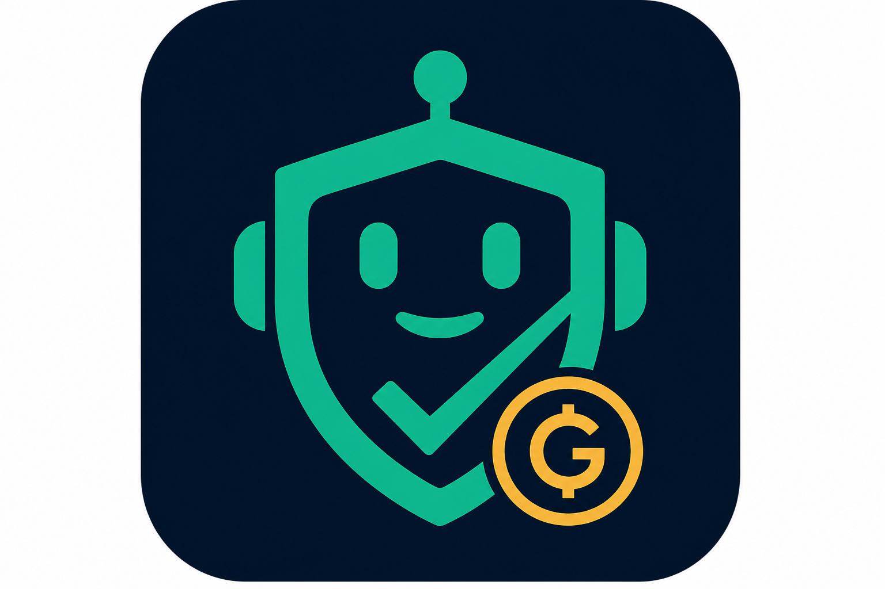

<p align="center">
  
</p>

# GoodDollar Agent ID

The passport-free **Proof-of-Human layer for AI agents** — powered by [GoodDollar](https://gooddollar.org) on Celo. Built for [GoodBuilders Season 4](https://ubi.gd/goodbuilders).

## What it is

**GoodDollar Agent ID** lets any GoodDollar **face-verified human** cryptographically vouch for their AI agents — issuing a verifiable, identity-only **Proof-of-Human credential** that plugs into the **ERC-8004** agent trust standard on Celo, backed by a **required, refundable G$ bond** (≥ 250 G$).

- **Agent ID SDK + MCP** — `signAgentId` / `verifyAgentId`: GoodDollar-rooted EIP-712 agent credentials any agent or app can use, plus a deployed ERC-8004 `IHumanProofProvider`.
- **Web app (MetaMask)** — the human on-ramp: connect → face-verify → stake the refundable bond → mint an Agent ID, all signed non-custodially.
- **Public Explorer** — verify any agent: human-backed? root, expiry, and its on-chain G$ bond.

The agent never holds the operator's keys. The human signs in their own wallet; signing is free, the required G$ bond is self-custodied in the vault and fully refundable, and each human can vouch for at most 10 active agents.

## The problem it solves

Celo's agent stack (ERC-8004 + Self Agent ID + Agent Visa) roots agent identity in **biometric passports / Aadhaar** — excluding the hundreds of millions of document-less people GoodDollar serves. So GoodDollar's ≈900K face-verified humans are **locked out of the agent economy**.

GoodDollar Agent ID adds the missing piece: a **passport-free, GoodDollar-rooted** Proof-of-Human provider that implements the *same* ERC-8004 `IHumanProofProvider` interface Self uses — deployed on Celo and ready for any `IERC8004ProofOfHuman` registry to adopt. Additive, not competitive.

## Who it's for

| Segment | What they get |
|---------|---------------|
| GoodDollar-verified humans (operators) | Stand behind their agents without a passport; lock a refundable G$ bond to register them |
| Agent builders | Drop-in passport-free Proof-of-Human for their agents |
| Verifiers (marketplaces, dApps, agents) | Check an agent is human-backed before trusting/paying it |

## How it works

```
Operator (web + MetaMask) ──verify (GoodDollar face)──▶ humanRoot
        │ sign EIP-712 AgentID (non-custodial)
        ▼
   Agent ID credential ──embed──▶ ERC-8004 agent metadata
        ▲                                   │
   verifyAgent(addr) ◀── SDK / MCP / REST ── Verifier
```

## Status

**GoodDollar Agent ID** — credential core, contract, API/MCP, website, and ERC-8004
interop are all in place (Phases A–F code-complete):

- **A** ✅ `packages/agent-id` — EIP-712 sign/verify with live human-root check (viem-only SDK)
- **B** ✅ API (`/agent/issue`, `/agent/verify/:address`, `/agent/list`) + MCP `gooddollar_verify_agent`
- **C/D** ✅ Website (MetaMask via Reown AppKit): stake bond, issue, My Agents, manage, public Explorer
- **E** ✅ `AgentVault` — required, refundable G$ bond with on-chain `minStake` (250 G$) **live on Celo mainnet** [`0x040904…7090`](https://celoscan.io/address/0x0409042B55e99Df8c0Feb7525A770838f3A47090)
- **F** ✅ ERC-8004 interop (encode/verify registration; registry reads) + SDK + MCP on npm (`@goodagent/agent-id`, `@goodagent/mcp-server`) + example
- **G** ✅ `GoodDollarHumanProofProvider` — a deployed ERC-8004 `IHumanProofProvider` reading the live GoodDollar whitelist **live on Celo mainnet** [`0x80c4…48c9`](https://celoscan.io/address/0x80c4de6872049cb20989156bca50134c781f48c9)

The credential is **identity-only** (the signed struct carries no money fields). To
register an agent the operator must lock a **refundable G$ bond ≥ 250 G$** (enforced
on-chain via `minStake` and at `/agent/issue`), a single human can vouch for at most 10
active agents, and the bond is read live from the vault. See
[docs/13-implementation-plan.md](./docs/13-implementation-plan.md).

## Prerequisites

- Node.js 20+
- pnpm 9+
- A WalletConnect/Reown project id in `VITE_WALLETCONNECT_PROJECT_ID` (for the wallet modal)
- A `DATABASE_URL` (Postgres/Supabase) for storing credentials

## Quick start

```bash
# Install dependencies
pnpm install

# Env (already present in .env for this repo)
cp .env.example .env

# Build all packages
pnpm build

# Push the DB schema (creates agent_credentials)
pnpm db:push

# Terminal 1 — API (http://localhost:3001/health)
pnpm dev:api

# Terminal 2 — Website (http://localhost:5173)
pnpm dev:web

# Optional — MCP server (stdio)
pnpm dev:mcp
```

## Monorepo layout

```
apps/
  api/            HTTP API (Hono) — /agent/* issue & verify
  web/            Vite + React website — MetaMask via Reown AppKit
                  (issue, My Agents, public verify)
packages/
  shared/         Constants, Zod, errors
  chain/          Viem Celo client + GoodDollar identity reads
  db/             Prisma schema
  mcp-server/     MCP tools (issueAgentId, verifyAgent, ...)
  agent-id/       EIP-712 credential sign/verify + ERC-8004
  contracts/      AgentVault — required refundable G$ bond (stake-only)
docs/             Overview, Agent ID spec & implementation plan
```

## Verify it works

```bash
# API health (live Celo RPC + DB)
curl http://localhost:3001/health

# Verify an agent (unknown → found:false)
curl http://localhost:3001/agent/verify/0x2222222222222222222222222222222222222222

# Website — open and connect MetaMask
open http://localhost:5173
#   Connect → (verify with GoodDollar if needed) → Issue an Agent ID
#   Public verify page: http://localhost:5173/verify?agent=0x…
```

Live Celo contracts: G$ `0x62B8…9c7A` · Identity `0xC361…2F42` · AgentVault `0x040904…7090` · GoodDollarHumanProofProvider `0x80c4…48c9` · ERC-8004 Identity Registry `0x8004…a432`.
Issuing a valid Agent ID requires the connected wallet to be a GoodDollar-verified
human (the API re-checks the live whitelist before storing).

## Documentation

Full docs: [docs/README.md](./docs/README.md)

## Database (Phase 2+)

```bash
docker compose up -d postgres
pnpm db:push
pnpm db:studio
```
