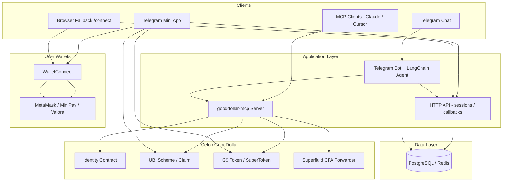
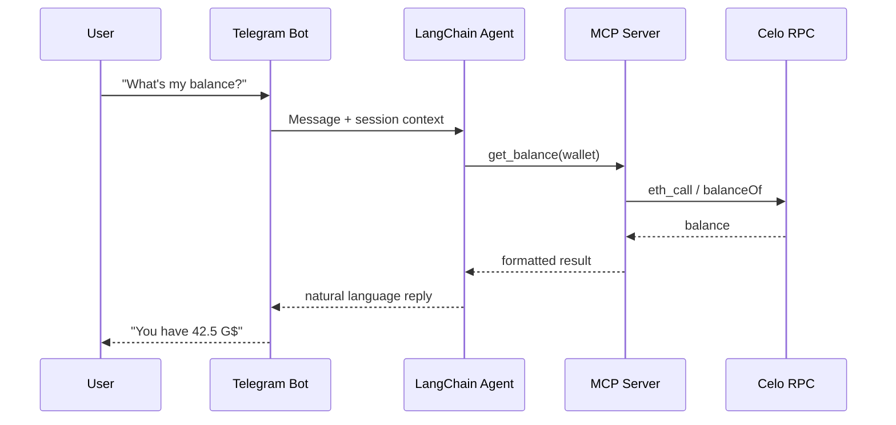
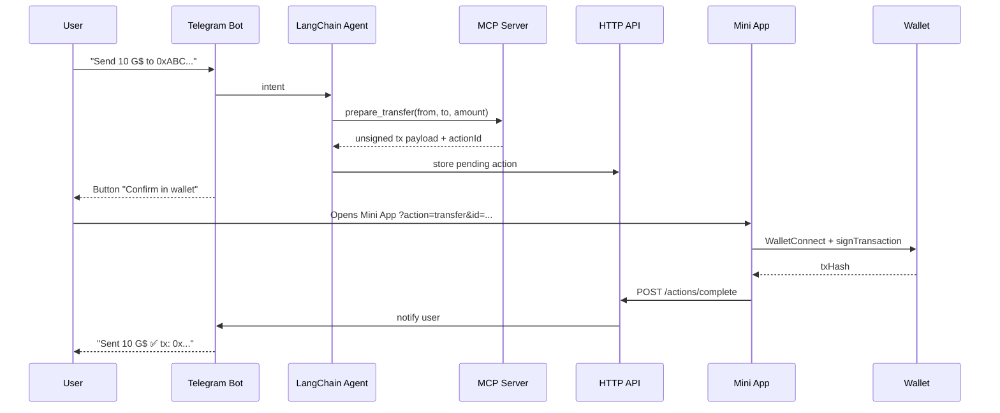
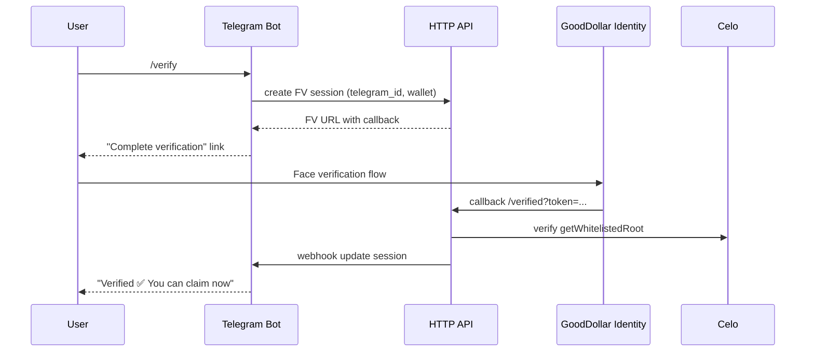
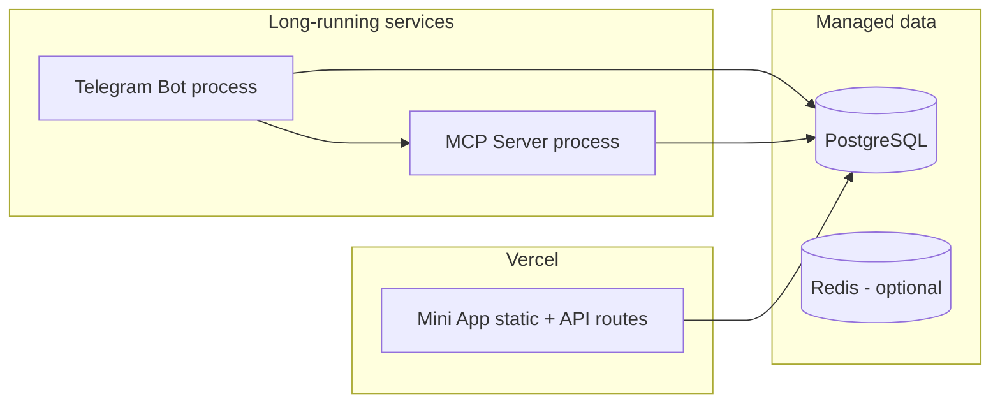

# Architecture

## System context

G$ Copilot sits between **users (Telegram)**, **AI orchestration (LangChain)**, **agent tooling (MCP)**, and **GoodDollar on Celo**.

## Component responsibilities

| Component | Responsibility | Does NOT do |
|-----------|----------------|-------------|
| **Telegram bot** | NLU, command routing, replies, Mini App buttons | Sign transactions, store keys |
| **LangChain agent** | Tool selection, conversation memory, guardrails | Direct chain writes without user sign |
| **MCP server** | Tool schemas, read-only chain calls, tx preparation | Broadcast signed txs (except via dedicated relay with user sig) |
| **Mini App** | WalletConnect, display tx, request wallet signature | Run LLM inference |
| **HTTP API** | FV callbacks, session tokens, pending tx store, webhooks | Custody funds |
| **Database** | Map telegram↔wallet, pending actions, audit log | Hold secrets beyond API keys |

## Request flows

### Flow A — Read-only query (no signing)

### Flow B — Write action (claim / send / stream)

### Flow C — Face verification

## Deployment topology

| Service | Host | Notes |
|---------|------|-------|
| Mini App + sign API | Vercel | Edge-friendly; FV callback URLs |
| Telegram bot | Railway / Fly.io / VPS | Long polling or webhook |
| MCP server | Same host or separate | stdio for local; SSE/HTTP for remote |
| Database | Neon / Supabase / Railway | Sessions + pending actions |
| Redis | Optional | Rate limits, FV token TTL |

## Environment separation

| Env | Chain | GoodDollar SDK env | Purpose |
|-----|-------|-------------------|---------|
| `development` | Celo Alfajores or dev G$ | `development` | Local bot + MCP testing |
| `staging` | Celo mainnet (limited) | `production` | Pre-launch QA |
| `production` | Celo mainnet | `production` | Season 4 users |

Dev wallet claims: [goodwallet.dev](https://goodwallet.dev)

## Key design decisions

1. **MCP as shared core** — Bot and external agents use the same tools; avoids duplicating chain logic.
2. **Mini App for all writes** — Single signing surface; consistent WalletConnect UX.
3. **Pending action pattern** — Bot stores intent server-side; Mini App loads by `actionId` (no unsigned tx in URL params alone).
4. **Telegram Web via QR** — WalletConnect shows QR on desktop; mobile Telegram uses deep links.
5. **Browser fallback** — `/connect` and `/sign` pages for MetaMask extension users outside Telegram WebView.

## Phase 2 extensions (documented, not v1)

- Community bill pool contracts + `/pool` commands
- Esusu / Balaio tool adapters in MCP
- Gas faucet tool (Esusu-style sponsorship for first claim)
- Flow State voting embed in Mini App
