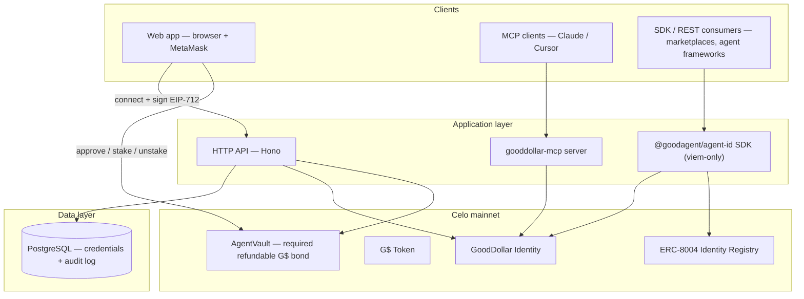
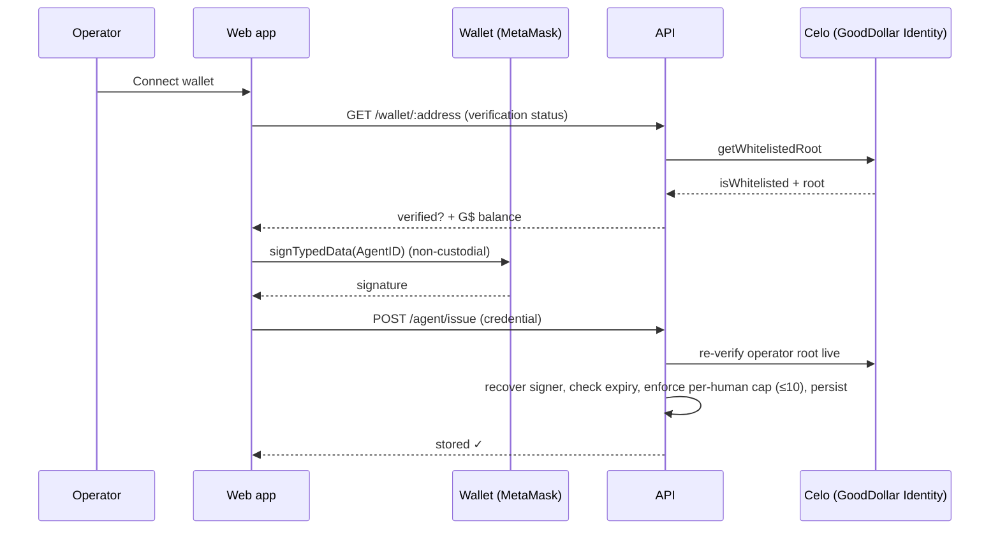
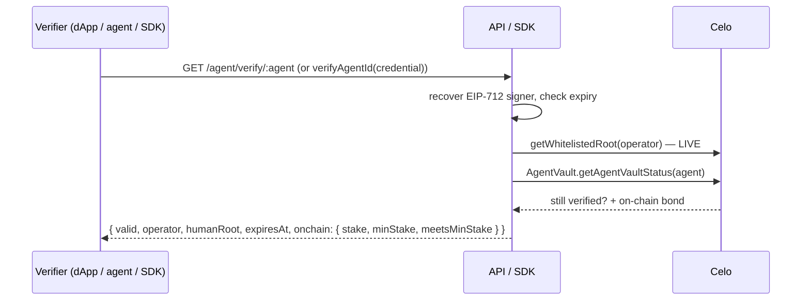
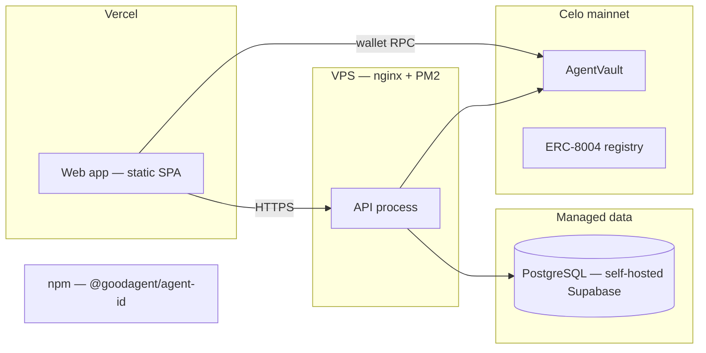

# Architecture

GoodDollar Agent ID is a **non-custodial Proof-of-Human layer for AI agents**. A
GoodDollar face-verified human signs an identity-only EIP-712 credential that binds
their human root to an agent address; to register that agent the human locks a
**required, refundable G$ bond** (≥ 250 G$) in `AgentVault`, and anyone can then
verify the agent is human-backed and bonded.

## System context

## Component responsibilities

| Component | Responsibility | Does NOT do |
|-----------|----------------|-------------|
| **Web app** (`apps/web`) | Connect wallet, gate on GoodDollar verification, stake the required refundable bond, sign the EIP-712 credential, manage stake, public verify page | Hold keys, run verification logic of record |
| **API** (`apps/api`) | Re-verify signed credentials, enforce the per-human cap, persist them, list by operator/human root, resolve + live-verify by agent, read on-chain stake | Custody funds, store private keys or PII |
| **SDK** (`packages/agent-id`, npm `@goodagent/agent-id`) | Build/sign/verify credentials, live human-root lookup, ERC-8004 encode/verify | Any server state |
| **MCP server** (`packages/mcp-server`) | Expose `verify_agent` + GoodDollar read tools to agent runtimes | Broadcast transactions |
| **Chain helpers** (`packages/chain`) | viem reads: identity, G$ balance, AgentVault stake, ERC-8004 agent | Sign or send funds |
| **Contracts** (`packages/contracts`) | `AgentVault` — required, refundable G$ bond with on-chain `minStake` (stake-only) | Custody beyond the operator's own deposits; any third-party transfer |
| **Database** (`packages/db`) | Index of signed credentials + append-only audit log | Cache verification verdicts; hold secrets |

## Request flows

### Flow A — Issue an Agent ID (operator signs)

### Flow B — Verify an agent (anyone)

### Flow C — Required refundable bond (operator)

Before issuing, the operator approves G$ to the `AgentVault`, then bonds at least
`minStake` (250 G$) behind the agent — this is required to register. The bond is
refundable and revocable after a cooldown, and surfaces on the verify page so
verifiers can apply their own (higher) minimum.

## Deployment topology

| Service | Host | Notes |
|---------|------|-------|
| Web app | Vercel | Static SPA; `gooddollar-agent-id.vercel.app` |
| API | VPS (nginx + PM2) | `gcopilot-api.geinz.lol`; CORS open for the SPA |
| MCP server | Same host / local stdio | `verify_agent` + GoodDollar reads |
| Database | Self-hosted Supabase (Postgres) | Credentials index + audit log |
| Contracts | Celo mainnet (42220) | `AgentVault` (stake-only) `0x0409042B55e99Df8c0Feb7525A770838f3A47090` |
| SDK | npm | `@goodagent/agent-id` (v0.2.0, identity-only) |

## Environment separation

| Env | Chain | GoodDollar SDK env |
|-----|-------|-------------------|
| `development` | Celo Alfajores / dev G$ | `development` |
| `production` | Celo mainnet | `production` |

## Key design decisions

1. **Non-custodial by construction** — the operator signs the credential in their
   own wallet; the server only re-verifies and indexes.
2. **Live human root** — verification re-reads the GoodDollar whitelist on every
   check, so a credential auto-invalidates if the operator's verification lapses.
3. **Minimal off-chain state** — only the signed credential and an audit log are
   stored; no PII, no cached verdicts (see [data model](./09-data-model.md)).
4. **Additive to ERC-8004** — a deployed `GoodDollarHumanProofProvider`
   implements the standard `IHumanProofProvider` interface (Celo
   `0x80c4…48c9`), and the proof also embeds in the agent registration file, so
   the Celo agent stack can adopt GoodDollar as a Proof-of-Human source.
5. **viem-only SDK** — the published SDK has a single runtime dependency so any
   agent framework can verify an agent in one call.
