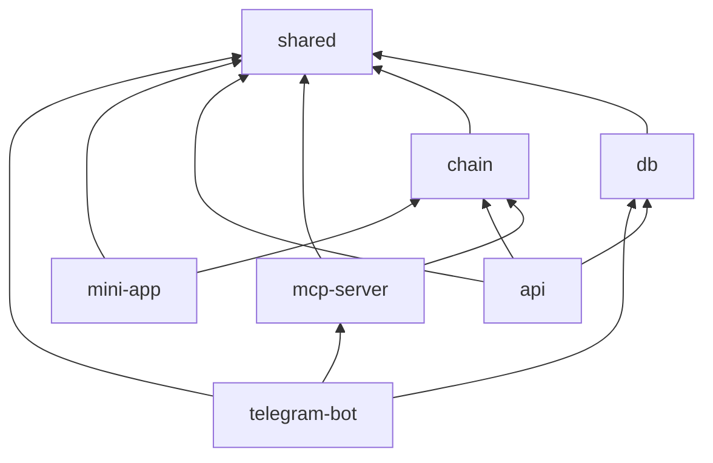

# Monorepo structure

Planned layout for the G$ Copilot monorepo (pnpm workspaces).

```
g-copilot/
├── apps/
│   ├── telegram-bot/          # LangChain + Telegraf bot
│   ├── mini-app/              # Vite + React Telegram Mini App
│   ├── web-fallback/          # Browser connect/sign pages (optional merge into mini-app)
│   └── api/                   # HTTP API: callbacks, sessions, webhooks
│
├── packages/
│   ├── mcp-server/            # gooddollar-mcp — MCP tool implementations
│   ├── chain/                 # Viem clients, addresses, ABIs, Superfluid helpers
│   ├── shared/                # Types, constants, validation (Zod)
│   └── db/                    # Prisma/Drizzle schema + repositories
│
├── docs/                      # Project documentation (this folder)
│
├── package.json               # Workspace root
├── pnpm-workspace.yaml
├── turbo.json                 # Optional: Turborepo task pipeline
├── .env.example
└── README.md                  # Quickstart (links to docs/)
```

## Package boundaries

### `apps/telegram-bot`

| Concern | Location |
|---------|----------|
| Telegraf handlers | `src/handlers/` |
| LangChain agent + tools wrapper | `src/agent/` |
| MCP client (calls local MCP or in-process) | `src/mcp/` |
| Session middleware | `src/middleware/session.ts` |

**Dependencies:** `@g-copilot/mcp-server`, `@g-copilot/shared`, `@g-copilot/db`, `langchain`, `telegraf`

### `apps/mini-app`

| Concern | Location |
|---------|----------|
| Wagmi config | `src/lib/wagmi.ts` |
| Connect page | `src/pages/Connect.tsx` |
| Sign / confirm page | `src/pages/Sign.tsx` |
| Telegram WebApp SDK integration | `src/lib/telegram.ts` |

**Dependencies:** `@g-copilot/chain`, `@g-copilot/shared`, `@goodsdks/citizen-sdk`, `wagmi`, `viem`

### `apps/api`

| Concern | Location |
|---------|----------|
| FV callback | `src/routes/identity/callback.ts` |
| Pending actions CRUD | `src/routes/actions/` |
| Telegram webhook (optional) | `src/routes/telegram/` |
| Health + metrics | `src/routes/health.ts` |

**Dependencies:** `@g-copilot/db`, `@g-copilot/chain`, `@g-copilot/shared`

### `packages/mcp-server`

| Concern | Location |
|---------|----------|
| MCP server entry | `src/index.ts` |
| Tool definitions | `src/tools/*.ts` |
| Tool registration | `src/server.ts` |

**Publish name:** `@gooddollar/mcp` or `gooddollar-mcp`

### `packages/chain`

| Concern | Location |
|---------|----------|
| Celo public client factory | `src/client.ts` |
| Contract addresses | `src/addresses.ts` |
| G$ / Identity / UBI ABIs | `src/abis/` |
| Superfluid stream helpers | `src/superfluid.ts` |
| Tx builders (unsigned) | `src/transactions/` |

### `packages/shared`

| Concern | Location |
|---------|----------|
| Zod schemas for tools + API | `src/schemas/` |
| Error types | `src/errors.ts` |
| Chain ID, decimals, limits | `src/constants.ts` |

### `packages/db`

| Concern | Location |
|---------|----------|
| Schema | `prisma/schema.prisma` or `src/schema.ts` |
| Repositories | `src/repositories/` |

## Inter-package dependency graph



## Scripts (root `package.json`)

```json
{
  "scripts": {
    "dev": "turbo dev",
    "dev:bot": "pnpm --filter telegram-bot dev",
    "dev:mini": "pnpm --filter mini-app dev",
    "dev:api": "pnpm --filter api dev",
    "dev:mcp": "pnpm --filter mcp-server dev",
    "build": "turbo build",
    "lint": "turbo lint",
    "db:push": "pnpm --filter db push",
    "db:studio": "pnpm --filter db studio"
  }
}
```

## Environment variables (`.env.example`)

```bash
# Telegram
TELEGRAM_BOT_TOKEN=
TELEGRAM_WEBHOOK_SECRET=          # if using webhooks
MINI_APP_URL=https://...          # Vercel URL for Mini App

# WalletConnect
WALLETCONNECT_PROJECT_ID=

# Database
DATABASE_URL=

# GoodDollar / Chain
GOODDOLLAR_ENV=production         # production | development
CELO_RPC_URL=https://forno.celo.org

# LLM
OPENAI_API_KEY=                   # or ANTHROPIC_API_KEY

# API
API_BASE_URL=https://...
FV_CALLBACK_SECRET=                 # HMAC for identity callbacks

# MCP (optional remote)
MCP_SERVER_URL=
```

## Implementation order

1. `packages/shared` + `packages/chain`
2. `packages/mcp-server` (read-only tools first)
3. `packages/db` + `apps/api`
4. `apps/mini-app` (connect + sign)
5. `apps/telegram-bot` (commands → MCP → Mini App buttons)

See [Roadmap & milestones](./11-roadmap-milestones.md).
