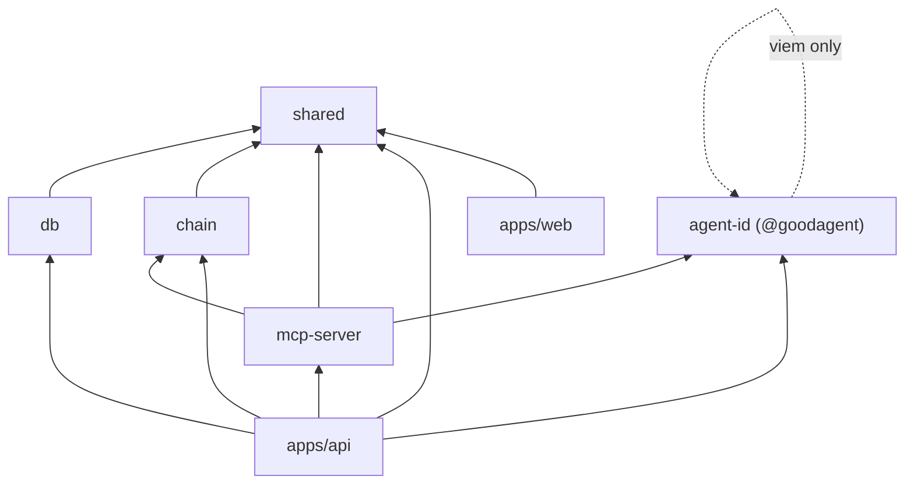

# Monorepo structure

pnpm workspace layout for GoodDollar Agent ID.

```
fff/
├── apps/
│   ├── web/                   # Vite + React + Wagmi/Reown — issue, verify, manage
│   └── api/                   # Hono HTTP API — issue / verify / list
│
├── packages/
│   ├── agent-id/              # SDK (npm: @goodagent/agent-id) — sign/verify + ERC-8004
│   ├── chain/                 # viem reads: identity, G$, AgentVault, ERC-8004
│   ├── contracts/             # Foundry — AgentVault.sol (required refundable G$ bond)
│   ├── db/                    # Prisma schema + repositories (credentials, audit)
│   ├── mcp-server/            # gooddollar-mcp — verify_agent + GoodDollar read tools
│   └── shared/                # Zod schemas, constants, error types
│
├── examples/                  # Runnable SDK demos (verify-agent.mjs)
├── docs/                      # Project documentation (this folder)
│
├── package.json               # Workspace root
├── pnpm-workspace.yaml
├── vercel.json                # Web app deploy config (monorepo build)
├── docker-compose.yml         # Local Postgres for dev
└── README.md
```

## Package boundaries

### `apps/web`

| Concern | Location |
|---------|----------|
| Wallet config (Reown AppKit + Wagmi) | `src/lib/wagmi.ts` |
| API client | `src/lib/api.ts` |
| EIP-712 credential helpers | `src/lib/agentId.ts` |
| AgentVault address/abi | `src/lib/vault.ts` |
| Pages | `src/pages/` — `Home`, `IssueAgent`, `Verify`, `MyAgents`, `ManageAgent` |

**Depends on:** `@goodagent/shared`, `wagmi`, `viem`, `@reown/appkit`

### `apps/api`

| Concern | Location |
|---------|----------|
| Routes + server | `src/index.ts` |

Routes: `GET /health`, `GET /wallet/:address`, `POST /agent/issue`,
`GET /agent/verify/:address`, `GET /agent/list?operator=`.

**Depends on:** `@goodagent/agent-id`, `@goodagent/chain`, `@goodagent/db`, `@goodagent/shared`

### `packages/agent-id` — published as `@goodagent/agent-id`

| Concern | Location |
|---------|----------|
| EIP-712 domain/types | `src/eip712.ts` |
| Build + sign | `src/sign.ts` |
| Verify (+ live human root) | `src/verify.ts`, `src/chain-lookup.ts` |
| Wire (bigint↔string) serialization | `src/serialize.ts` |
| ERC-8004 encode / verify | `src/erc8004.ts` |

**Runtime dependency:** `viem` only.

### `packages/chain`

| Concern | Location |
|---------|----------|
| Celo client | `src/client.ts` |
| Addresses (G$, AgentVault, ERC-8004) | `src/addresses.ts` |
| ABIs | `src/abis.ts` |
| Reads (identity, balance, vault, erc8004) | `src/reads.ts` |

### `packages/contracts`

Foundry project for two contracts:
- `AgentVault.sol` — required, refundable G$ bond with on-chain `minStake`
  (250 G$) enforcement. Deployed to Celo mainnet at
  `0x0409042B55e99Df8c0Feb7525A770838f3A47090`.
- `GoodDollarHumanProofProvider.sol` — a standard ERC-8004 `IHumanProofProvider`
  backed by the GoodDollar whitelist. Deployed to Celo mainnet at
  `0x80c4de6872049cb20989156bca50134c781f48c9`.

### `packages/db`

| Concern | Location |
|---------|----------|
| Prisma schema | `prisma/schema.prisma` (`AgentCredential`, `AuditLog`) |
| Credential repository | `src/agent-credentials.ts` |
| Audit log | `src/audit.ts` |

### `packages/mcp-server`

`gooddollar-mcp` — stdio MCP server. Tools: `gooddollar_verify_agent` plus
GoodDollar reads (`get_balance`, `verify_status`, `claim_eligibility`,
`get_daily_stats`, `ping`). See [MCP server](./04-mcp-server.md).

### `packages/shared`

Zod schemas (`src/schemas/`), constants (chain id, decimals), error types.

## Inter-package dependency graph



## Common scripts

```bash
pnpm --filter @goodagent/web dev          # web app (Vite, :5173)
pnpm --filter @goodagent/api dev          # API (tsx watch, :3001)
pnpm --filter @goodagent/agent-id test    # SDK unit tests
pnpm --filter @goodagent/db db:push       # apply Prisma schema
pnpm --filter @goodagent/examples verify  # run the SDK example
```

See [implementation plan](./13-implementation-plan.md) for the phased build.
