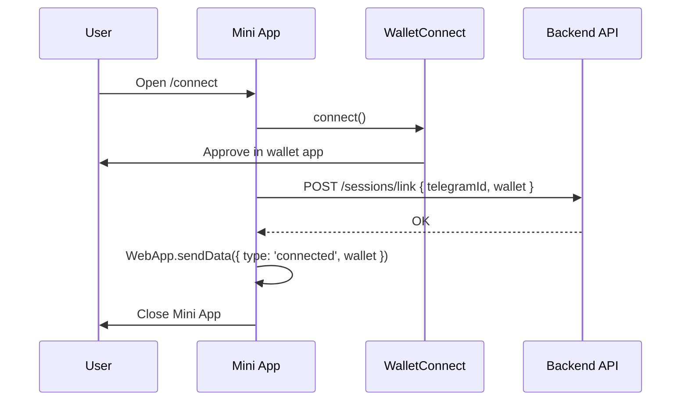

# Telegram Mini App

The Mini App is a **Vite + React** web app opened inside Telegram via `WebApp` buttons. It handles **wallet connection** and **transaction signing**.

**URL:** hosted on Vercel (e.g. `https://g-copilot.vercel.app`)

## Routes

| Route | Purpose |
|-------|---------|
| `/connect?tg={telegramId}` | Link wallet to Telegram session |
| `/sign/{actionId}` | Review and sign pending action |
| `/verify-complete` | Post-FV landing (optional UX) |

## Telegram WebApp SDK

```typescript
import WebApp from '@twa-dev/sdk';

WebApp.ready();
WebApp.expand();

const telegramId = WebApp.initDataUnsafe?.user?.id;
// Also read ?tg= from URL as fallback
```

**Validate init data** on API for production (HMAC with bot token) — see [Telegram docs](https://core.telegram.org/bots/webapps#validating-data-received-via-the-mini-app).

## Wagmi configuration

```typescript
import { createConfig, http } from 'wagmi';
import { celo } from 'wagmi/chains';
import { walletConnect } from 'wagmi/connectors';

export const config = createConfig({
  chains: [celo],
  connectors: [
    walletConnect({
      projectId: import.meta.env.VITE_WALLETCONNECT_PROJECT_ID,
      showQrModal: true,
    }),
  ],
  transports: {
    [celo.id]: http(import.meta.env.VITE_CELO_RPC_URL),
  },
});
```

**Note:** Use `metaMask()` connector only on **browser fallback** pages, not inside Telegram WebView.

## Connect flow (`/connect`)



### Connect page UI

- Headline: "Connect your Celo wallet"
- Subtext: "Supports MiniPay, MetaMask, Valora"
- Primary button: "Connect wallet" (opens WC modal)
- Desktop hint: "Scan QR with your phone wallet"
- Link: "Open in browser" → fallback URL

## Sign flow (`/sign/{actionId}`)

1. Fetch pending action from API: `GET /actions/{actionId}`
2. Display summary (type, amount, to, gas estimate)
3. Ensure connected wallet === action.from
4. Build tx with `@goodsdks/citizen-sdk` + viem
5. `sendTransaction` / `writeContract` via wagmi
6. Wait for receipt
7. `POST /actions/{actionId}/complete` with txHash
8. `WebApp.sendData({ actionId, txHash, status: 'completed' })`
9. `WebApp.close()`

### Sign page UI by action type

| Type | Display |
|------|---------|
| `claim` | "Claim ~X G$ daily UBI" |
| `transfer` | "Send X G$ to 0x..." |
| `create_stream` | "Stream X G$/month to 0x..." |

Always show:

- Network: Celo
- Wallet address (truncated)
- Cancel button → close without signing

## Claim integration

```typescript
import { ClaimSDK } from '@goodsdks/citizen-sdk';
import { useWalletClient, usePublicClient } from 'wagmi';

// After wallet connected:
const claimSDK = await ClaimSDK.init({
  publicClient,
  walletClient,
  identitySDK,
  env: 'production',
});

const amount = await claimSDK.checkEntitlement();
if (amount > 0n) {
  const hash = await claimSDK.claim();
}
```

## Transfer integration

Standard G$ ERC-20 transfer on Celo:

- Token: `0x62B8B11039FcfE5aB0C56E502b1C372A3d2a9c7A` (mainnet)

## Stream integration

Use Superfluid CFA forwarder per GoodDollar docs:

- Compute flow rate: `amountPerMonth * 1e18 / 2592000`
- Check buffer via `getBufferAmountByFlowrate` before create
- Account for G$ protocol fees on stream

## Platform-specific UX

| Platform | Connect UX |
|----------|------------|
| Telegram mobile | WC tap → wallet app opens |
| Telegram Web / Desktop | WC QR → scan with phone |
| Browser fallback | WC + optional MetaMask extension |

Show conditional banner:

```tsx
{isTelegramWeb && (
  <p>On computer? Scan the QR code with your phone wallet.</p>
)}
```

## Security checklist

- [ ] Validate Telegram `initData` on API for session link
- [ ] Reject sign if wallet !== action.from
- [ ] Expire actions after 15 minutes
- [ ] No private keys in frontend storage
- [ ] CSP headers on Vercel
- [ ] HTTPS only

## File layout

```
apps/mini-app/src/
├── main.tsx
├── App.tsx
├── lib/
│   ├── wagmi.ts
│   ├── telegram.ts
│   └── api.ts
├── pages/
│   ├── Connect.tsx
│   └── Sign.tsx
├── components/
│   ├── WalletButton.tsx
│   ├── ActionSummary.tsx
│   └── NetworkBadge.tsx
└── hooks/
    ├── useTelegramUser.ts
    └── usePendingAction.ts
```

## Environment variables

```bash
VITE_WALLETCONNECT_PROJECT_ID=
VITE_CELO_RPC_URL=https://forno.celo.org
VITE_API_BASE_URL=https://api.g-copilot.example.com
VITE_GOODDOLLAR_ENV=production
```
