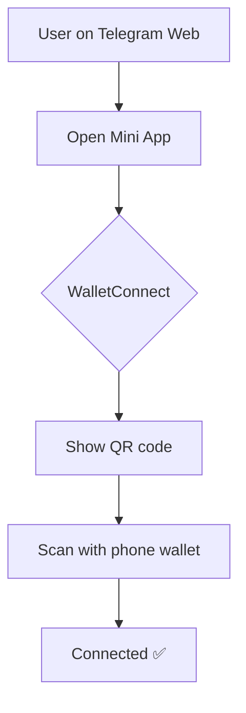
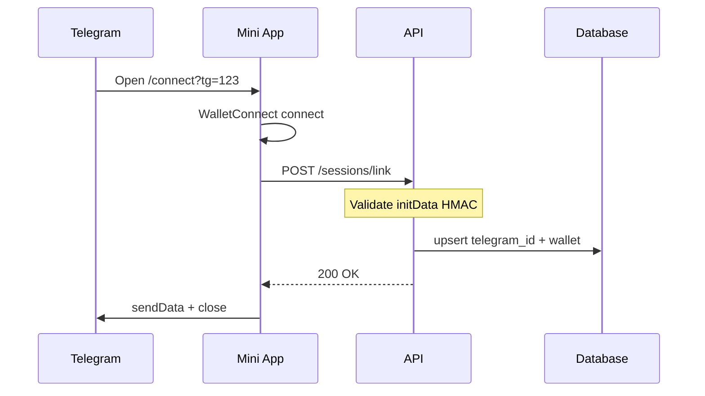

# Wallet connection

How users connect wallets and sign transactions across **Telegram mobile**, **Telegram Web**, and **browser fallback**.

## Core principle

> The bot and LLM **never** hold private keys.  
> All writes require explicit approval in the user's wallet app or browser extension.

## Supported wallets

Via **WalletConnect v2** on Celo (chain ID `42220`):

| Wallet | Typical user | Telegram mobile | Telegram Web |
|--------|--------------|-----------------|--------------|
| **MiniPay** | GoodDollar / Celo users | ✅ Deep link | ✅ QR scan |
| **MetaMask mobile** | General crypto | ✅ Deep link | ✅ QR scan |
| **Valora** | Celo native | ✅ Deep link | ✅ QR scan |
| **MetaMask extension** | Desktop power users | N/A | ⚠️ Browser fallback only |
| **GoodWallet** | GoodDollar | ✅ Via WC if supported | ✅ QR scan |

Design for **WalletConnect broadly**, not MetaMask alone.

## Connection methods by surface

### 1. Telegram Mini App (primary)

Used for `/connect` and all `/sign/{actionId}` flows.

**Mobile Telegram**

1. User taps Web App button
2. Mini App opens in Telegram in-app browser
3. User taps "Connect wallet"
4. WalletConnect modal → select wallet
5. Wallet app opens → user approves connection

**Telegram Web / Desktop**

1. Same Web App button
2. Mini App shows **WalletConnect QR code**
3. User scans with phone wallet (MetaMask mobile, MiniPay, etc.)
4. Session established — signing also happens on phone

### 2. Browser fallback (secondary)

Standalone pages outside Telegram WebView for users who want **MetaMask extension**:

| URL | Purpose |
|-----|---------|
| `{APP_URL}/connect?session={token}` | Connect wallet, link to telegram via token |
| `{APP_URL}/sign/{actionId}` | Sign when Mini App fails |

**Flow**

1. Bot sends link: "Having trouble? Open in browser"
2. User opens in Chrome / Firefox
3. Wagmi `metaMask()` + `walletConnect()` connectors available
4. After connect/sign → API updates session → bot notifies user in chat

### 3. Face verification (not wallet signing)

Identity verification uses GoodDollar's **browser face-verify flow**, separate from WalletConnect:

1. Bot sends `verifyUrl` from Identity SDK
2. User completes scan in mobile/desktop browser
3. Callback hits API → marks session verified
4. **Claim still requires wallet signature** afterward

## Signing flow summary

| Step | Where | Who signs |
|------|-------|-----------|
| Connect wallet | Mini App or browser | Wallet connect approval |
| Face verify | External browser link | Identity protocol |
| Claim UBI | Mini App `/sign/{id}` | Wallet tx signature |
| Send G$ | Mini App `/sign/{id}` | Wallet tx signature |
| Create stream | Mini App `/sign/{id}` | Wallet tx signature |

## Session linking

## Gas requirements

Users need **CELO** for gas on Celo (unless sponsored).

| Phase | Approach |
|-------|----------|
| v1 | User pays gas; bot warns if CELO balance low |
| v2 | Gas faucet integration (Esusu-style) for first claim |

Check CELO balance in Mini App before sign; show friendly error if insufficient.

## Common failure modes

| Issue | Cause | Fix |
|-------|-------|-----|
| Extension not detected | Telegram WebView blocks injection | Use QR or browser fallback |
| Wrong network | Wallet on Ethereum mainnet | Prompt switch to Celo in wagmi |
| WC session expired | Idle timeout | Reconnect button |
| Wallet ≠ linked session | User switched accounts | Block sign; ask reconnect |
| Insufficient CELO | No gas | Link to CELO faucet / sponsor (v2) |

## UX copy (recommended)

**Mini App connect screen**

> Connect your wallet on Celo to use G$ Copilot.  
> **On phone:** tap your wallet below.  
> **On computer:** scan the QR with your phone wallet.  
> [Connect wallet] · [Open in browser instead]

**Before sign**

> Review this transaction in your wallet.  
> G$ Copilot cannot move funds without your approval.

## Implementation checklist

- [ ] WalletConnect project ID registered at [cloud.walletconnect.com](https://cloud.walletconnect.com)
- [ ] Celo as only/default chain in wagmi config
- [ ] QR modal enabled for desktop (`showQrModal: true`)
- [ ] Browser fallback routes deployed on same domain
- [ ] Telegram initData validation on session link API
- [ ] CeloScan links in confirmation messages
