# Data model

Database schema for sessions, pending actions, and audit logs.

**Recommended:** PostgreSQL via Prisma or Drizzle.

## Entity relationship

```mermaid
erDiagram
    TELEGRAM_SESSION ||--o{ PENDING_ACTION : creates
    TELEGRAM_SESSION ||--o{ AUDIT_LOG : generates
    PENDING_ACTION ||--o| TRANSACTION : completes

    TELEGRAM_SESSION {
        string telegram_id PK
        string wallet_address
        boolean verified
        string fv_callback_token
        timestamp wallet_linked_at
        timestamp verified_at
        timestamp created_at
        timestamp updated_at
    }

    PENDING_ACTION {
        string id PK
        string telegram_id FK
        string action_type
        string status
        json payload
        string tx_hash
        timestamp expires_at
        timestamp completed_at
        timestamp created_at
    }

    AUDIT_LOG {
        string id PK
        string telegram_id
        string event_type
        json metadata
        timestamp created_at
    }
```



## Tables

### `telegram_sessions`

| Column | Type | Notes |
|--------|------|-------|
| `telegram_id` | `TEXT PK` | Telegram user ID |
| `wallet_address` | `TEXT NULL` | Checksummed `0x...` |
| `verified` | `BOOLEAN` | Cached; revalidate on-chain periodically |
| `fv_callback_token` | `TEXT NULL` | One-time FV session token |
| `wallet_linked_at` | `TIMESTAMP` | |
| `verified_at` | `TIMESTAMP` | |
| `created_at` | `TIMESTAMP` | |
| `updated_at` | `TIMESTAMP` | |

**Indexes:** `wallet_address`

### `pending_actions`

| Column | Type | Notes |
|--------|------|-------|
| `id` | `TEXT PK` | `act_{uuid}` |
| `telegram_id` | `TEXT FK` | |
| `action_type` | `ENUM` | `claim`, `transfer`, `create_stream` |
| `status` | `ENUM` | `pending`, `completed`, `expired`, `failed` |
| `payload` | `JSONB` | `{ from, to, amount, flowRate, ... }` |
| `tx_hash` | `TEXT NULL` | Set on completion |
| `expires_at` | `TIMESTAMP` | Default: created + 15 min |
| `completed_at` | `TIMESTAMP NULL` | |
| `created_at` | `TIMESTAMP` | |

**Indexes:** `telegram_id`, `status`, `expires_at`

### `audit_logs`

| Column | Type | Notes |
|--------|------|-------|
| `id` | `TEXT PK` | |
| `telegram_id` | `TEXT` | |
| `event_type` | `TEXT` | e.g. `wallet_linked`, `claim_completed` |
| `metadata` | `JSONB` | `{ actionId, txHash, tool, ... }` |
| `created_at` | `TIMESTAMP` | |

Append-only for accountability.

## Prisma schema (reference)

```prisma
model TelegramSession {
  telegramId       String    @id @map("telegram_id")
  walletAddress    String?   @map("wallet_address")
  verified         Boolean   @default(false)
  fvCallbackToken  String?   @map("fv_callback_token")
  walletLinkedAt   DateTime? @map("wallet_linked_at")
  verifiedAt       DateTime? @map("verified_at")
  createdAt        DateTime  @default(now()) @map("created_at")
  updatedAt        DateTime  @updatedAt @map("updated_at")
  actions          PendingAction[]

  @@map("telegram_sessions")
}

enum ActionType {
  claim
  transfer
  create_stream
}

enum ActionStatus {
  pending
  completed
  expired
  failed
}

model PendingAction {
  id          String       @id
  telegramId  String       @map("telegram_id")
  actionType  ActionType   @map("action_type")
  status      ActionStatus @default(pending)
  payload     Json
  txHash      String?      @map("tx_hash")
  expiresAt   DateTime     @map("expires_at")
  completedAt DateTime?    @map("completed_at")
  createdAt   DateTime     @default(now()) @map("created_at")
  session     TelegramSession @relation(fields: [telegramId], references: [telegramId])

  @@index([telegramId])
  @@index([status])
  @@map("pending_actions")
}
```

## API operations

| Endpoint | Method | Description |
|----------|--------|-------------|
| `/sessions/link` | POST | Link wallet to telegramId |
| `/sessions/:telegramId` | GET | Get session (internal/bot) |
| `/identity/callback` | GET | FV callback handler |
| `/actions` | POST | Create pending action |
| `/actions/:id` | GET | Fetch action for Mini App |
| `/actions/:id/complete` | POST | Mark complete with txHash |
| `/actions/expire` | CRON | Expire stale pending actions |

## Session link request

```json
POST /sessions/link
{
  "telegramId": "123456789",
  "wallet": "0x...",
  "initData": "..."   // Telegram WebApp initData for HMAC validation
}
```

## Pending action payload examples

**Transfer**

```json
{
  "from": "0x...",
  "to": "0x...",
  "amountWei": "10000000000000000000",
  "amountFormatted": "10.0"
}
```

**Stream**

```json
{
  "from": "0x...",
  "to": "0x...",
  "flowRatePerMonth": "5.0",
  "flowRateWei": "..."
}
```

## Caching (optional Redis)

| Key | TTL | Value |
|-----|-----|-------|
| `verify:{wallet}` | 5 min | `{ isWhitelisted, root }` |
| `rate:prepare:{telegramId}` | 1 hour | request count |
| `fv:token:{token}` | 1 hour | telegramId |

## Data retention

| Data | Retention |
|------|-----------|
| Sessions | Indefinite (user can `/disconnect`) |
| Completed actions | 90 days minimum (metrics) |
| Audit logs | 1 year |
| Expired pending actions | Delete after 30 days |

## Privacy

- Store **telegram_id + wallet** only — no PII beyond Telegram profile optional cache
- Do not store face verification biometrics (handled by GoodDollar Identity service)
- GDPR: support `/disconnect` to delete session row on request
