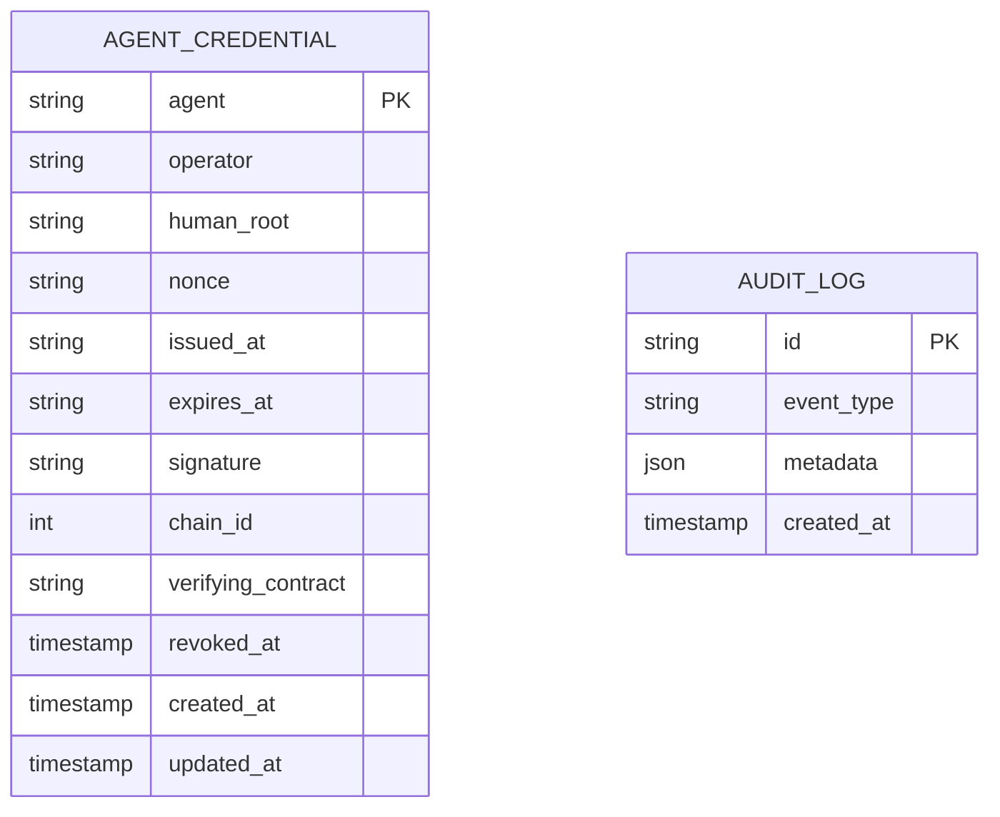

# Data model

The API persists very little: signed Agent ID credentials and an append-only
audit log. Everything trust-related (human verification, the required G$ bond)
lives **on-chain**; the database is just a queryable index of issued credentials.

**Storage:** PostgreSQL via Prisma (`packages/db`). Live on self-hosted Supabase.

## Entities

### `agent_credentials`

The signed EIP-712 Agent ID credential (the off-chain source of truth for an
agent's identity). Numeric fields are stored as **decimal strings** to
round-trip `uint256`/`uint64` exactly (see `packages/agent-id` wire form).

| Column | Type | Notes |
|--------|------|-------|
| `agent` | `TEXT PK` | The agent's address (checksummed) |
| `operator` | `TEXT` | The GoodDollar-verified human who signed |
| `human_root` | `TEXT` | Operator's GoodDollar root at issuance |
| `nonce` | `TEXT` | Per-operator nonce |
| `issued_at` / `expires_at` | `TEXT` | Unix seconds (string) |
| `signature` | `TEXT` | EIP-712 signature |
| `chain_id` | `INT` | EIP-712 domain chain id |
| `verifying_contract` | `TEXT` | EIP-712 domain contract |
| `revoked_at` | `TIMESTAMP NULL` | Set when the operator revokes |
| `created_at` / `updated_at` | `TIMESTAMP` | |

**Indexes:** `operator` (for the "My Agents" list) and `human_root` (for the
per-human cap of 10 active agents and "all agents this human vouched for").

### `audit_logs`

Append-only accountability trail.

| Column | Type | Notes |
|--------|------|-------|
| `id` | `TEXT PK` | cuid |
| `event_type` | `TEXT` | e.g. `agent_id_issued` |
| `metadata` | `JSONB` | `{ agent, operator, ... }` |
| `created_at` | `TIMESTAMP` | |

## Why so little off-chain?

Verification re-reads the GoodDollar whitelist **live** on every check, and the
required G$ bond is read from the `AgentVault` contract (`packages/contracts`).
The database never holds keys, never caches verification verdicts, and stores no
PII — it's purely an index so operators can list their agents and the public
explorer can resolve a stored credential by agent address.

## API operations

| Endpoint | Method | Description |
|----------|--------|-------------|
| `/agent/issue` | POST | Re-verify a signed credential, require an active on-chain bond ≥ `minStake`, enforce the per-human cap, then persist it |
| `/agent/verify/:address` | GET | Resolve + live-verify a credential (+ on-chain bond, `minStake`, `meetsMinStake`; `?minStake=` adds a verifier-chosen check) |
| `/agent/list?operator=` | GET | List an operator's issued agents |
| `/agent/list?humanRoot=` | GET | List every agent a GoodDollar human has vouched for (+ `activeCount`, `maxPerHuman`) |
| `/wallet/:address` | GET | Read-only GoodDollar status for an address |
