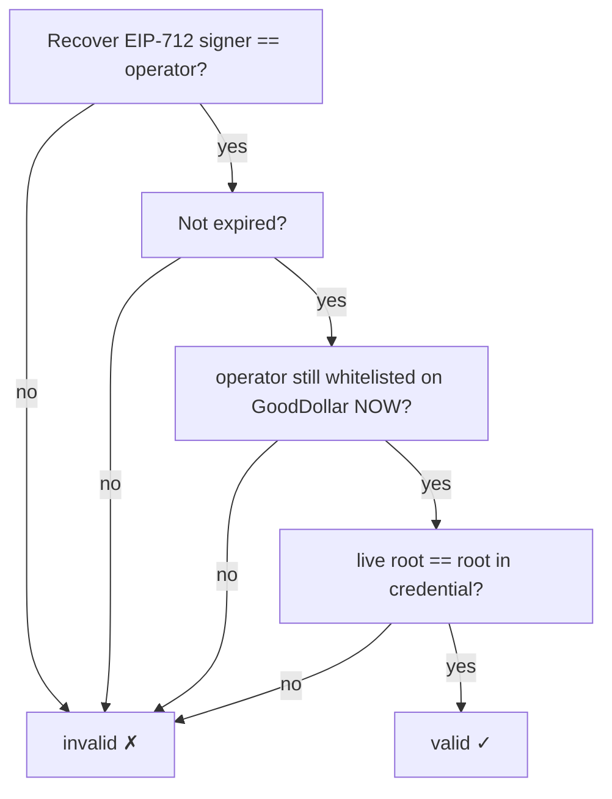

# Security

Threat model and security requirements for GoodDollar Agent ID.

## Design posture

The system is **non-custodial and stateless about trust**:

- The operator signs the EIP-712 credential in their **own wallet**. The server
  never holds keys, mnemonics, or the operator's funds.
- Verification re-reads the GoodDollar whitelist **live** on every check, so the
  server never relies on a cached or self-asserted verification verdict.
- The required G$ bond lives **on-chain** in `AgentVault` (stake-only); the
  operator alone can stake or withdraw it from their wallet, the bond is fully
  refundable, and the contract never sends funds to any third party.
- The database stores only the signed credential and an append-only audit log —
  no PII, no secrets (see [data model](./09-data-model.md)).

## Assets to protect

| Asset | Risk if compromised |
|-------|---------------------|
| Operator wallet | Direct financial loss (held only by the user, never the server) |
| `AgentVault` deposits | Loss of the operator's own staked G$ |
| Database (credential index) | Tampered credentials presented as valid |
| API host secrets (`DATABASE_URL`) | Read/write access to the index |

## Non-negotiable rules

1. **Never store or request seed phrases / private keys.**
2. **Never sign or broadcast on the user's behalf** — all writes happen in the
   operator's wallet.
3. **Re-verify on issue and on every verify** — recover the EIP-712 signer, check
   expiry, and read the operator's GoodDollar root live; reject if it no longer
   matches.
4. **Bind the EIP-712 domain** (chain id + verifying contract) so a signature for
   one deployment can't be replayed against another.
5. **Treat the credential as the source of truth**, not any client-supplied
   "valid" flag.
6. **Enforce the per-human cap** — a single GoodDollar human (`humanRoot`) may
   vouch for at most 10 active agents, checked at issue time, to limit sybil
   fan-out.
7. **Require an active bond ≥ `minStake`** — `/agent/issue` reads the live
   `AgentVault` bond for the agent and rejects registration unless it meets the
   protocol minimum, so every registered agent carries skin-in-the-game.

## What makes a credential valid

A credential therefore **auto-invalidates** the moment the operator's GoodDollar
verification lapses — no revocation call required (though the operator can also
revoke a stored credential explicitly).

## API surface

| Concern | Control |
|---------|---------|
| CORS | Open (`*`) by design — the verify/issue endpoints take signed, self-authenticating data; no cookies/sessions |
| Input validation | All bodies validated with Zod (`packages/shared`) before use |
| Issue endpoint | Re-verifies the signature + live root server-side before persisting; a forged credential cannot be stored |
| No auth tokens | There are no sessions or bearer tokens to steal; writes to chain need the operator's wallet |

## Secrets management

| Secret | Storage |
|--------|---------|
| `DATABASE_URL` | Server env only, never shipped to client |
| `VITE_WALLETCONNECT_PROJECT_ID` | Public in frontend (expected — it's a client id) |
| Deployer `PRIVATE_KEY` | Local `.env` for `forge script` only; gitignored; **not** used by the running app |

The root `.env` is gitignored and excluded from deploys; never commit it.

## Frontend security

- HTTPS everywhere.
- No secrets in `VITE_*` except public ids.
- The user always signs in their own wallet, which shows the exact typed data.

## Pre-launch checklist

- [ ] No private keys in repo, logs, or client bundle
- [ ] EIP-712 domain pinned to chain id + verifying contract
- [ ] Issue endpoint re-verifies signature + live root server-side
- [ ] All request bodies Zod-validated
- [ ] `.env` gitignored and excluded from rsync/deploys
- [ ] Dependencies audited (`pnpm audit`)
- [ ] Error messages don't leak internal paths
