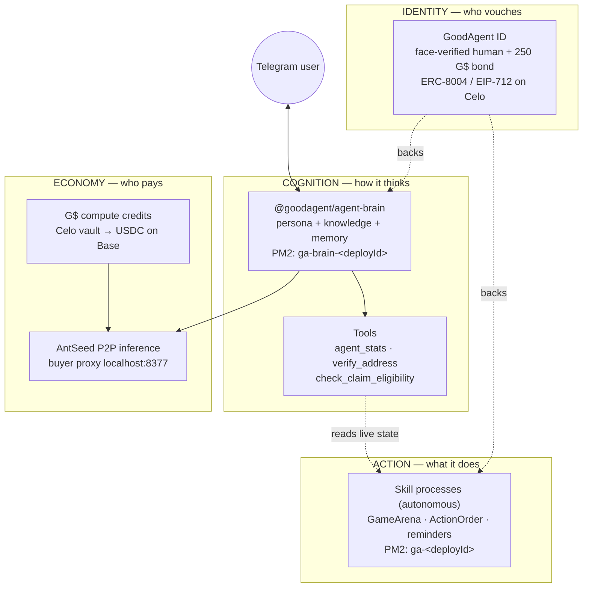
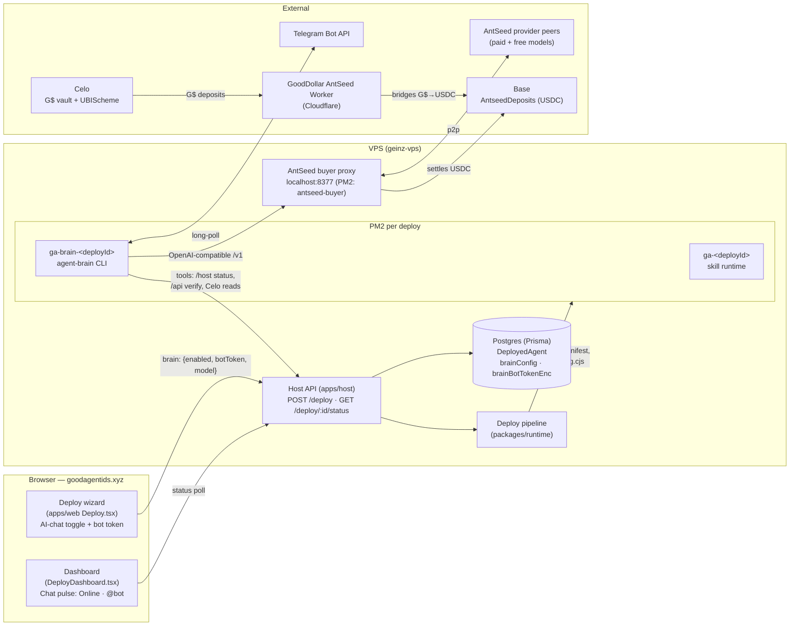
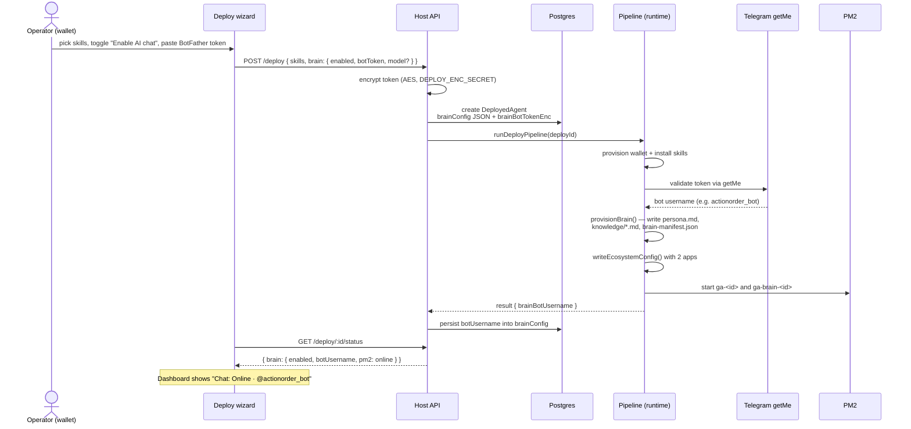
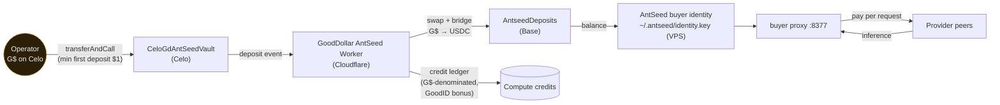
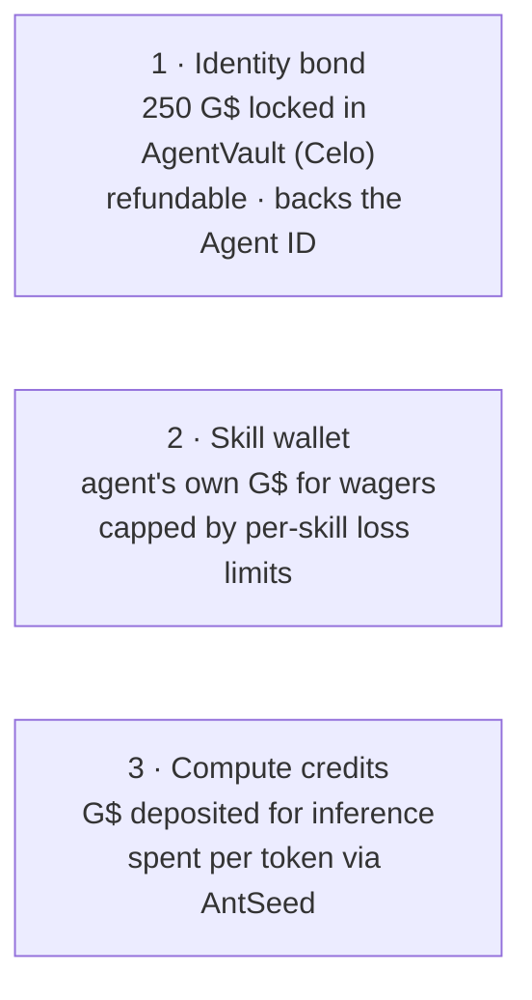

# 21 — Agent Brain Architecture (implemented)

The hybrid agent architecture as **actually shipped**: every hosted GoodAgent
deploy can attach an LLM "brain" that runs beside its action skills, chats on
Telegram, calls live tools, and pays for inference with GoodDollars through
the decentralized AntSeed network.

Companion to the design-phase document
(`packages/agent-runtime/REAL_AGENT_ARCHITECTURE.md`). Where the two differ,
this file describes what is running in production.

- Pilot: **My ACTION-ORDER Agent** (`@actionorder_bot`) — brain + 2 game skills.
- Productized: "Enable AI chat (Telegram)" toggle in the deploy wizard at
  goodagentids.xyz/deploy.

---

## 1. The idea in one diagram

A deployed agent used to be only the bottom row (a scripted skill loop under
PM2). The new architecture adds a cognitive layer on top and an economic layer
underneath, without touching the deterministic skill processes.



Key property: **brain and body are separate PM2 processes.** If AntSeed peers
are slow or down, the game skill keeps playing. If a skill crashes, the bot
keeps chatting.

---

## 2. System components

Everything that participates in a brain-enabled deploy, across the user's
browser, the VPS, and the chains.



Package map:

| Package | Role |
| --- | --- |
| `packages/agent-brain` | Brain runtime: orchestrator, LLM client, memory, Telegram channel, tools |
| `packages/runtime` | Deploy pipeline: wallet, skills, **brain-provision.ts**, PM2 ecosystem |
| `packages/db` | Prisma models; brain config + encrypted token on `DeployedAgent` |
| `apps/host` | Host API on the VPS: deploy CRUD, status (incl. brain), pause/resume |
| `apps/web` | Wizard (enable-chat toggle) + dashboard (chat status chip) |
| `scripts/setup-antseed-vps.sh` | Installs/configures the AntSeed buyer proxy on the VPS |
| `scripts/deploy-host-vps.sh` | Syncs runtime + agent-brain + host to the VPS, sets `BRAIN_LLM_BASE_URL`, `BRAIN_DEFAULT_MODEL` |

---

## 3. Deploy flow — how a brain is born

What happens when a user enables AI chat in the wizard.



Failure isolation rules baked into the pipeline:

- Bad bot token → the deploy **fails fast** at `validateTelegramBotToken`,
  before any PM2 process starts.
- Pause/resume and stop/start manage **both** processes
  (`ga-<id>` and `ga-brain-<id>`) together.
- The public API strips `brainBotTokenEnc`; the token is only ever decrypted
  inside the pipeline to inject into the brain's PM2 env.

---

## 4. Chat request flow — a message, end to end

```mermaid
sequenceDiagram
    actor U as Telegram user
    participant T as Telegram
    participant B as ga-brain-&lt;id&gt;<br/>(agent-brain)
    participant M as Session memory<br/>(brain-memory/)
    participant X as AntSeed buyer proxy<br/>localhost:8377/v1
    participant PR as Provider peer
    participant HO as Host API / Celo

    U->>T: "how are your games going today?"
    T->>B: update (long-poll)
    B->>M: load session history
    B->>X: POST /v1/chat/completions<br/>(persona + knowledge + history + tools)
    X->>PR: p2p inference request
    PR-->>X: tool_call: agent_stats
    X-->>B: tool_call: agent_stats
    B->>HO: GET /deploy/:id/status (live record, balance)
    HO-->>B: { record: 187-219, today: 88, ... }
    B->>X: tool result → second completion
    X->>PR: continue
    PR-->>X: final text
    X-->>B: "Played 88 matches today, 187 wins overall…"
    B->>B: stripMarkdown() — Telegram-safe plain text
    B->>M: append turns
    B->>T: sendMessage
    T->>U: reply
```

Tool contract (all read-only):

| Tool | What it does | Backed by |
| --- | --- | --- |
| `agent_stats` | Live match record, balance, uptime for this deploy | Host status API |
| `verify_address` | Is this address a human-backed GoodAgent? | GoodAgent verify (Celo) |
| `check_claim_eligibility` | Can this wallet claim UBI now? | UBIScheme on Celo |

Chat is deliberately **read-only company**: the brain cannot move funds,
place bets, or reconfigure the agent. Guardrails live in the generated
persona (no model self-identification, plain text only, English by default,
never ask for seed phrases) plus `stripMarkdown()` on every outbound message.

---

## 5. Funding flow — G$ in, inference out

AntSeed settles in USDC on Base, but users only ever touch G$. The GoodDollar
AntSeed integration bridges between the two.



One-time consent: the buyer signs an EIP-712 `SetOperator` message so the
GoodDollar operator may deposit on its behalf (`NotDepositsOperator` guard on
Base).

### Three stores of value — don't confuse them



Pulling the bond kills the identity. Emptying the skill wallet stops wagers.
Exhausting credits silences the brain. Each is independent by design.

---

## 6. On-disk anatomy of a brain-enabled deploy

```text
~/goodagent-agents/<deployId>/
├── ecosystem.config.cjs        # PM2: ga-<id> + ga-brain-<id>
├── brain-manifest.json         # model, channels, persona/knowledge paths, tools
├── brain/
│   ├── persona.md              # generated system prompt (preset: gaming|assistant)
│   └── knowledge/
│       ├── gooddollar-ubi.md   # UBI facts (claim window, GoodID, gooddapp.org)
│       └── scam-patterns.md    # scam heuristics the bot warns about
├── brain-memory/               # rolling per-chat session history
├── logs/                       # skill + brain out/err logs
└── skills/...                  # installed skill runtimes
```

PM2 processes per deploy:

| Process | Runs | Env (highlights) |
| --- | --- | --- |
| `ga-<deployId>` | skill runtime (games, reminders) | agent wallet key, skill config |
| `ga-brain-<deployId>` | `@goodagent/agent-brain` CLI | `TELEGRAM_BOT_TOKEN` (decrypted), `BRAIN_LLM_BASE_URL=http://localhost:8377/v1`, `BRAIN_MODEL`, `GOODAGENT_HOST_URL`, `BRAIN_MEMORY_DIR`, `API_BASE` |

Shared VPS process: `antseed-buyer` (one proxy serves all brains).

---

## 7. Data model

`DeployedAgent` additions (Prisma):

```prisma
model DeployedAgent {
  // ...existing fields...
  brainConfig      String?  @map("brain_config")        @db.Text  // JSON
  brainBotTokenEnc String?  @map("brain_bot_token_enc") @db.Text  // AES-encrypted
}
```

`brainConfig` JSON shape (`DeployBrainConfig`):

```json
{
  "enabled": true,
  "model": "deepseek-v4-flash",
  "personaPreset": "gaming",
  "tools": ["verify_address", "check_claim_eligibility", "agent_stats"],
  "botUsername": "actionorder_bot"
}
```

Host API surface:

| Endpoint | Brain behaviour |
| --- | --- |
| `POST /deploy` | accepts `brain { enabled, botToken, model?, personaPreset?, tools? }`; encrypts token at rest |
| `GET /deploy/:id/status` | returns `brain { enabled, model, botUsername, pm2 }` for the dashboard |
| pause / resume / stop / start | operate on the skill **and** brain processes together |

---

## 8. Why this architecture matters

1. **Bots → agents.** Skills alone are scripted loops. With perception
   (messages, live stats), reasoning (LLM planning), and action (tool calls),
   the deploy satisfies the real perceive–reason–act agent loop.
2. **Accountable AI.** Every brain hangs off a GoodAgent ID: a face-verified
   human vouched on-chain and locked a refundable 250 G$ bond. "Who is
   responsible for this bot?" has a verifiable answer.
3. **UBI-powered cognition.** No OpenAI key anywhere. Inference is bought
   with G$ — the same currency the agents serve — through a permissionless
   P2P network. Anyone GoodDollar-verified can afford an intelligent agent.
4. **Failure isolation.** Two processes, one supervisor. Slow peers never
   cost a game; a crashed skill never kills the conversation.
5. **Productized.** What took hand-rolled SSH surgery for the ACTION-ORDER
   pilot is now a wizard checkbox: persona generation, token encryption, PM2
   wiring and status reporting all happen in the pipeline.
6. **An economic loop, not a cost center.** Credits are per-deploy and
   G$-denominated. The planned "Top up with G$" dashboard flow makes each
   agent a self-funding unit.

## 9. Status and roadmap

| Phase | Item | Status |
| --- | --- | --- |
| 0 | Host–worker credit wiring (profile, record deposit, outstanding) | done |
| 1 | Brain runtime + ACTION-ORDER pilot + claim-reminder bot | done (live) |
| 1.5 | Brain in the deploy pipeline + wizard toggle + dashboard status | done (live) |
| 2 | "Top up with G$" + buyer address QR in dashboard | next |
| 3 | Superfluid G$ stream option for always-on agents | planned |
| 4 | Worker chat proxy → per-message G$ credit spend | planned |
| 5 | Hybrid brain supervising GameArena plugin | planned |
| 6 | AntSeed provider mode (`ant-agent`) — agents sell expertise | planned |
