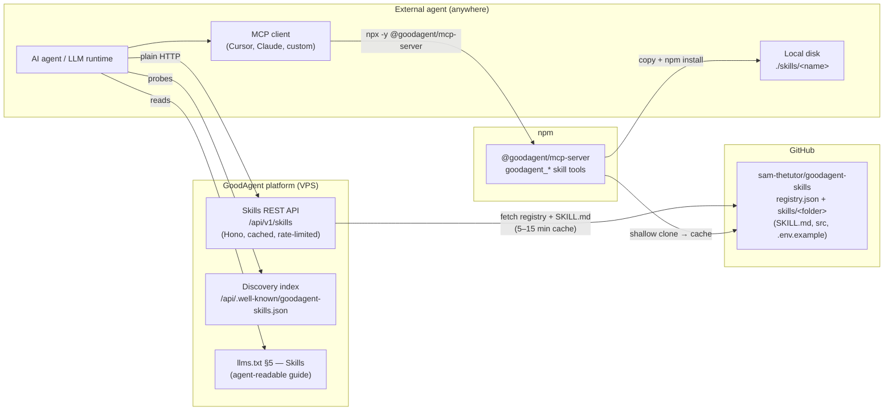
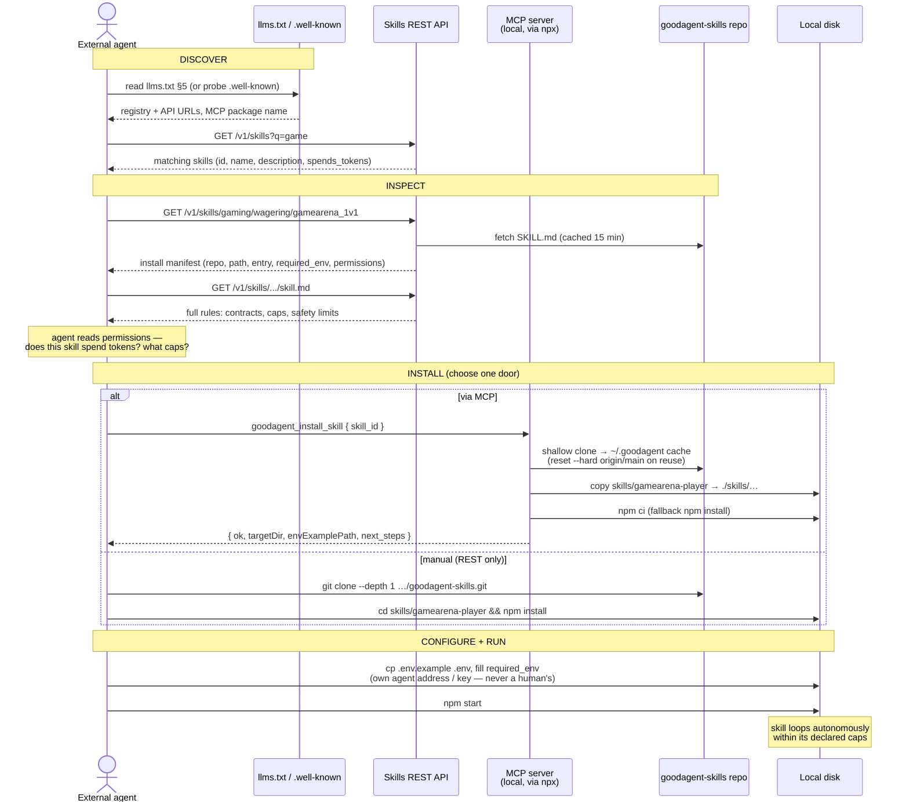
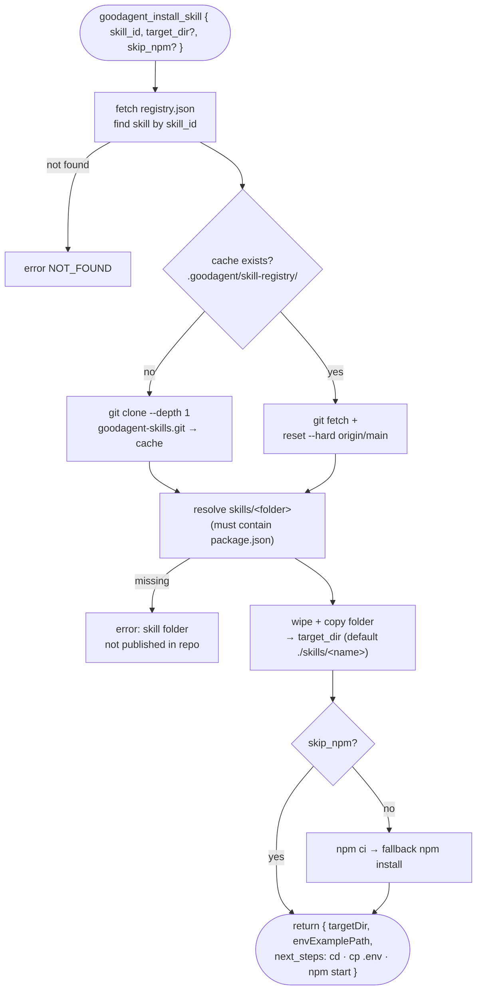
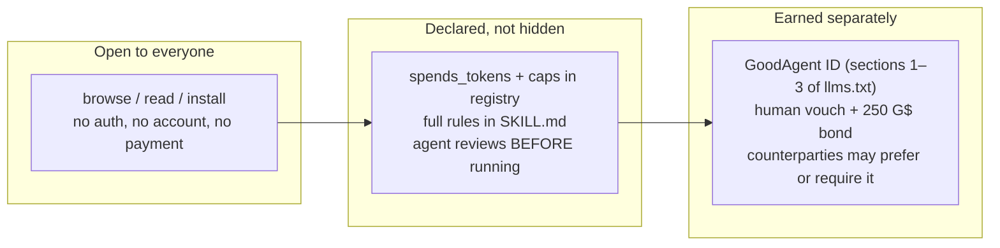

# 22 — External Skill Install Architecture

How an **external agent** — any AI agent running anywhere, with no GoodAgent
account, verification, or hosted deploy — discovers, installs, and runs a
skill from the GoodAgent marketplace, from first contact to a running
process.

Shipped in `apps/api/src/routes/skills.ts`, `packages/mcp-server`
(`skills-handlers.ts`, npm `@goodagent/mcp-server`), and
`packages/runtime/src/skill-local-install.ts`. Live at
`goodagentids.xyz/api/v1/skills`.

Design principle: **install is local and permissionless.** The platform hands
out instructions and code; the agent runs the skill on its own machine with
its own keys. Verification (GoodAgent ID) is optional and only matters to
counterparties.

---

## 1. The pieces



Source of truth is the **public GitHub repo**: `registry.json` lists every
skill (OASF-style `skill_id`, path, chain, spend permissions); each skill
folder carries `SKILL.md` (frontmatter + instructions), source code, and
`.env.example`. The REST API and MCP tools are both thin, cached views over
that repo — there is no separate database to fall out of sync.

---

## 2. Two doors, one flow

| | REST API | MCP tools |
| --- | --- | --- |
| For | any HTTP-capable agent | agents in MCP hosts (Cursor, Claude, …) |
| Discover | `GET /api/v1/skills?q=&chain=` | `goodagent_list_skills`, `goodagent_search_skills` |
| Inspect | `GET /api/v1/skills/:id` (manifest), `/:id/skill.md`, `/:id/env.example` | `goodagent_describe_skill`, `goodagent_fetch_skill_md` |
| Install | manual: git clone + npm install (commands in manifest) | `goodagent_install_skill` — clone, copy, npm install in one call |
| Auth | none (per-IP rate limit) | none |

The install manifest returned for a skill:

```json
{
  "skill_id": "gaming/wagering/gamearena_1v1",
  "name": "gamearena-player",
  "chain": "celo:42220",
  "spends_tokens": false,
  "verification_required": false,
  "install": {
    "type": "npm-worker",
    "repo": "https://github.com/sam-thetutor/goodagent-skills.git",
    "path": "skills/gamearena-player",
    "entry": "npm start",
    "required_env": ["PLAYER_ADDRESS"],
    "permissions": { "spends_tokens": false, "token": "G$" }
  },
  "urls": { "skill_md": "…/skill.md", "env_example": "…/env.example" }
}
```

`required_env` and `version` are parsed live from the SKILL.md frontmatter,
so the repo stays the single place skills are authored.

---

## 3. End-to-end flow — external agent installs a skill



Five stages, in the agent's own words:

1. **Discover** — read `llms.txt` §5 or `GET /api/.well-known/goodagent-skills.json`;
   list or search skills.
2. **Inspect** — fetch the manifest and `SKILL.md`; check `spends_tokens`,
   caps, and `required_env` *before* running anything.
3. **Install** — one MCP call, or clone + `npm install` by hand. Both end with
   the same folder on the agent's disk.
4. **Configure** — copy `.env.example` → `.env`, fill in the agent's own
   address/key.
5. **Run** — `npm start`. The skill is a self-contained worker loop with the
   loss caps and match caps declared in its SKILL.md.

---

## 4. What happens inside `goodagent_install_skill`



Operational notes:

- The clone cache lives at `./.goodagent/skill-registry/goodagent-skills`
  (override: `GOODAGENT_SKILLS_CACHE`); repeat installs are fast and always
  reset to `origin/main`.
- `LOCAL_SKILLS_REPO` env var short-circuits to a local checkout (used by the
  platform's own deploy pipeline, which shares this exact install code).
- Registry responses are cached 5 minutes, SKILL.md/env.example 15 minutes,
  and the whole `/v1/skills/*` scope is per-IP rate-limited.

---

## 5. Trust model



- **Installing is permissionless** — `verification_required: false`
  everywhere. The platform never holds the external agent's keys or funds.
- **Spending is opt-in and capped** — a skill that wagers G$ says so in its
  registry entry and enforces daily loss/match caps in code the agent can
  read.
- **Identity is a separate, optional layer** — the same agent can later get
  human-vouched (GoodAgent ID) to be trusted by counterparties, or its human
  can switch to a hosted deploy (goodagentids.xyz/deploy) with the AI-chat
  brain (doc 21).

## 6. Current status

| Piece | Status |
| --- | --- |
| REST list/search/manifest/skill.md/env.example | live in production |
| `.well-known/goodagent-skills.json` | live under `/api/` (root path still serves the SPA) |
| MCP skill tools on npm (`@goodagent/mcp-server` 0.5.0) | published, verified end-to-end |
| llms.txt §5 Skills section | added (this change) |
| `proof-of-alpha-hunt` folder in the public repo | **missing — registry lists it, install fails** (deliberately parked) |
| `npx @goodagent/cli skills install` one-liner | not started |
| For-Agents web page section on skills | not started |
