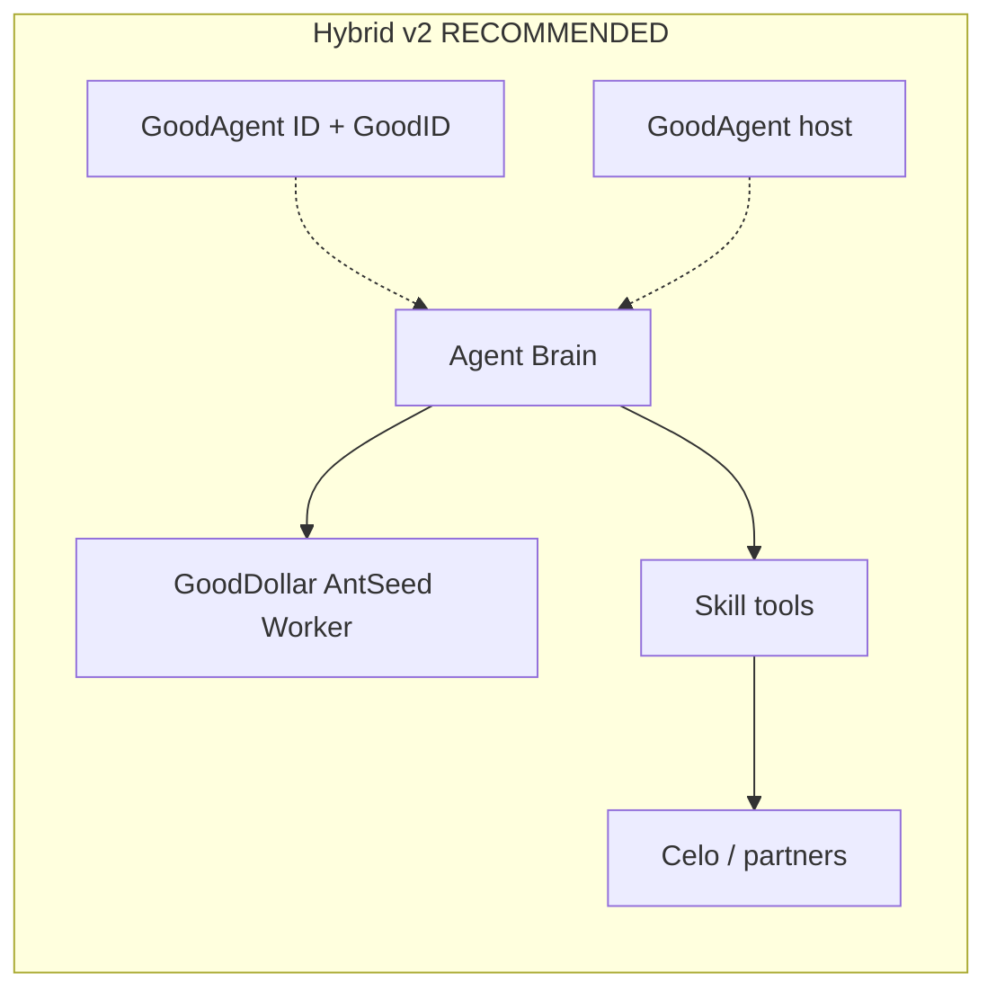
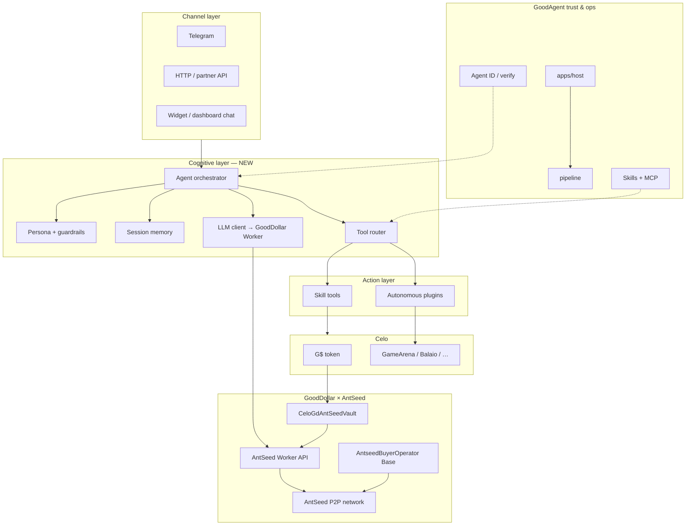
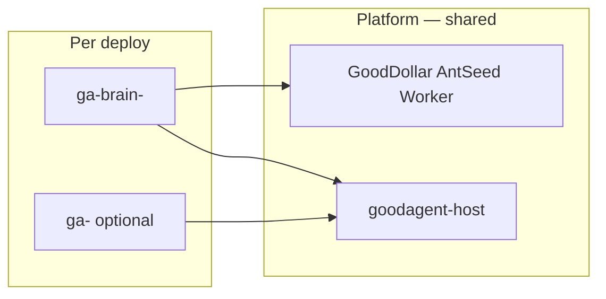
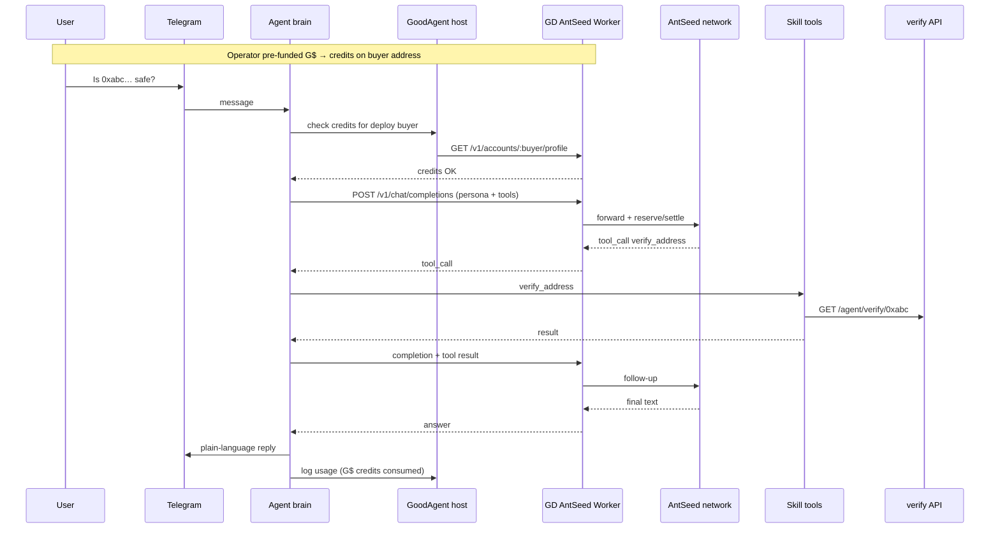
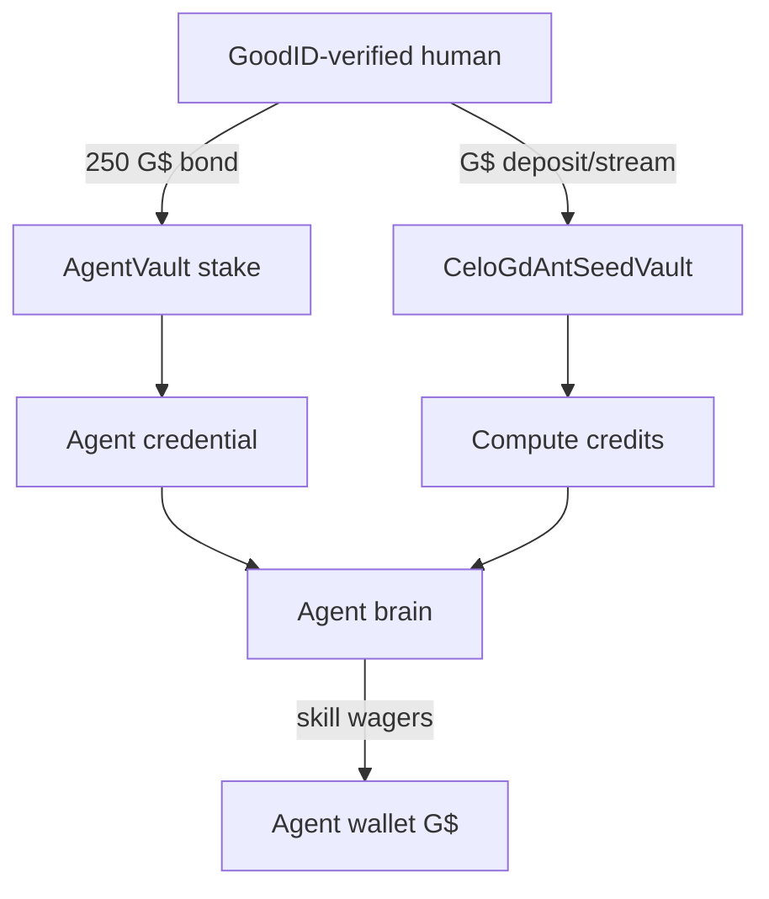

# GoodAgent — Real AI Agent Architecture (G$ + AntSeed + Skills)

> **Status:** architecture target (v2)  
> **Supersedes:** “one PM2 process = one skill script” (v1)  
> **Inference:** [GoodDollar × AntSeed integration](https://github.com/GoodDollar/antseed-integration) — users pay **G$**; AntSeed settles on Base internally  
> **Identity & deploy:** existing GoodAgent stack (unchanged)

---

## 1. The shift

| Today (v1) | Target (v2) |
|------------|---------------|
| Skill = long-running **script** (poll chain, play moves, send Telegram) | Skill = **tool module** the agent invokes when needed |
| No LLM loop; logic is hardcoded TypeScript | **Perceive → plan → act** loop powered by AntSeed-routed models |
| One deploy ≈ one autonomous daemon | One deploy = **one agent brain** + N skills + optional channels |
| GoodAgent ID wraps the wallet | GoodAgent ID wraps the **whole agent** (reputation + bond) |
| No AI spend rail | **G$ → compute credits** via GoodDollar AntSeed vault |

GoodAgent keeps what it’s best at: **human-backed identity**, deploy/hosting, skills marketplace, on-chain actions on Celo.  
AntSeed adds **open-market inference**. The **GoodDollar integration** makes that inference **G$-native** for operators and users — no USDC wallet required in the product UX.

---

## 2. Two payment layers (important)

AntSeed’s raw protocol uses **USDC on Base** ([light paper](https://antseed.com/docs/lightpaper/)). GoodDollar wraps that for the ecosystem:

```text
USER-FACING (GoodDollar)                    BACKEND (AntSeed ops — invisible to users)
─────────────────────────                   ────────────────────────────────────────
G$ deposit / Superfluid stream    →    CeloGdAntSeedVault (Celo)
       ↓                                      ↓
GoodDollar AntSeed Worker         →    AntseedBuyerOperator.deposit (Base USDC)
       ↓                                      ↓
Compute credits (micro-USD accounting) →  AntSeed P2P network → AI providers
```

| Layer | Token | Who touches it |
|-------|-------|----------------|
| **GoodDollar credit layer** | **G$** on Celo | Operators, end users, platform |
| **AntSeed buyer layer** | USDC on Base | GoodAgent / GoodDollar **backend operator only** |

Users and deployers **never buy USDC**. They deposit or stream **G$** and receive **compute credits** (+10% deposit bonus, +20% stream bonus with GoodID — see [USER_GUIDE](https://github.com/GoodDollar/antseed-integration/blob/main/docs/USER_GUIDE.md)).

---

## 3. Decision: Hybrid (recommended)



| Option | Verdict |
|--------|---------|
| **Script-only (v1)** | Keep for **latency-critical** game skills |
| **All-in-one monolith** | Reject |
| **Hybrid v2** | **Build this** — brain + tools + optional autonomous plugins |

**Hybrid rule:**  
- **Brain** = LLM loop + memory + channels (Telegram, HTTP, widget).  
- **Skills** = **tools** (on-demand) or **autonomous plugins** (GameArena hot path).  
- **GoodAgent** = trust rail + deploy + G$ credit wallet mapping.  
- **GoodDollar AntSeed Worker** = inference gateway + credit accounting (not raw `localhost:8377` in product UX).

---

## 4. Layer model



---

## 5. G$ funding — who pays for inference

| Agent type | Who funds G$ credits | End user pays? |
|------------|----------------------|----------------|
| **Flagship** (GoodRemind, address checker) | **Platform** (ops wallet streams/deposits G$) | No |
| **User-deployed brain agent** | **Operator** (same human who vouches 250 G$) | No (v1) |
| **Stream-powered agent** | Operator **Superfluid stream** to vault (+20% bonus) | No |
| **Premium / later** | End user tops up agent’s buyer address | Optional |
| **Autonomous game skill only** | Minimal / no LLM credits | N/A |

### How an operator purchases compute (deploy UX)

1. Deploy agent on goodagentids.xyz → pipeline provisions brain + **AntSeed buyer address** (per deploy or per operator).
2. **Top up with G$** — one `transferAndCall` to `CeloGdAntSeedVault`:

```solidity
GoodDollar.transferAndCall(
  CELO_GD_ANTSEED_VAULT,
  amountGdWei,
  abi.encode(ANTSEED_BUYER_ADDRESS_FOR_THIS_DEPLOY)
);
```

3. Host calls Worker: `POST /v1/celo/events/record { txHash }` → credits issued (+10% if GoodID verified).
4. Dashboard shows **G$ credits remaining** (via `GET /v1/accounts/:buyer/profile`).
5. Brain runs only while credits > 0; low balance → notify operator to deposit more G$.

### Stream option (always-on agents)

Operator opens a **Superfluid G$ stream** to the vault with `userData = abi.encode(buyerAddress)` → +20% streaming bonus ([USER_GUIDE](https://github.com/GoodDollar/antseed-integration/blob/main/docs/USER_GUIDE.md)).

### Credit formula (Worker-side)

```text
principal = gdAmount × gdUsdPrice
bonus     = +10% (deposit) or +20% (stream) if GoodID verified
credits   = principal + min(bonus, monthlyCapRemaining)
```

Credits fund the **AntSeed buyer deposit** for the `buyerAddress` encoded at deposit time — typically one buyer address per deploy or per operator.

---

## 6. GoodDollar AntSeed integration (GoodAgent wiring)

| Concern | Integration piece | GoodAgent usage |
|---------|-------------------|-----------------|
| User payment | `CeloGdAntSeedVault` on Celo | Deploy UI: “Top up with G$” |
| Credit accounting | GoodDollar AntSeed Worker (Cloudflare) | Host records txs; brain checks balance |
| LLM access | Worker OpenAI-compatible proxy *(future phase)* | Brain `OPENAI_BASE_URL` → Worker |
| Dev / fallback | Raw AntSeed buyer `localhost:8377` | **Dev only** — not exposed to operators |
| Model routing | `"model": "<peerId>@deepseek-v4-flash"` | Platform default + per-deploy override |
| Identity for bonus | GoodID `getWhitelistedRoot` | Same humans who vouch agents get +10/+20% |
| Agent ID bond | 250 G$ `AgentVault` | Unchanged — separate from compute credits |

**Per-deploy brain config (production):**

```bash
# Inference (via GoodDollar Worker when proxy is live)
GOODAGENT_ANTSEED_API=https://YOUR_GOODDOLLAR_ANTSEED_WORKER
GOODAGENT_ANTSEED_BUYER=0x...          # AntSeed buyer address for this deploy
GOODAGENT_ANTSEED_API_KEY=gd_live_...  # when auth phase ships

# Model
GOODAGENT_ANTSEED_MODEL=<peerId>@deepseek-v4-flash

# Spend cap (GoodAgent-side, in G$ credit terms)
GOODAGENT_MAX_CREDITS_MICRO_USD_PER_DAY=2000000   # $2.00
```

**Platform ops (invisible to users):**

- Run / partner with GoodDollar AntSeed Worker + `AntseedBuyerOperator` on Base.
- Monitor `GET /config/status` — vault configured, bridge enabled.
- Retry failed funding via `GET .../outstanding` + re-submit `txHash`.

> **Note:** Wallet auth + `/v1/chat/completions` proxy on the Worker are marked **coming soon** in upstream docs. Until live, dev can use raw AntSeed buyer locally; production UX still shows **G$ top-up** and queues requests against credited buyer balance.

References: [antseed-integration README](https://github.com/GoodDollar/antseed-integration), [PAYMENT_FLOW.md](https://github.com/GoodDollar/antseed-integration/blob/main/docs/PAYMENT_FLOW.md), [USER_GUIDE.md](https://github.com/GoodDollar/antseed-integration/blob/main/docs/USER_GUIDE.md).

---

## 7. Agent folder layout (on disk)

```
<AGENTS_ROOT>/<deployId>/
├── manifest.json              # v2: brain + antseedBuyerAddress
├── meta.json
├── ecosystem.config.cjs
├── brain/
│   ├── agent.json             # persona, guardrails, knowledge catalog
│   ├── persona.md
│   ├── guardrails.json
│   ├── knowledge/
│   │   ├── gooddollar-ubi.md
│   │   └── scam-patterns.md
│   └── tools/
│       ├── verify_address.js
│       └── check_claim_eligibility.js
├── skills/                    # goodagent-skills registry
├── memory/
│   └── sessions.sqlite
└── credits.json               # cached balance snapshot from Worker API
```

No per-agent `ANTSEED_DATA_DIR` in production — credits are keyed by **buyer address** on the Worker, not local USDC files.

---

## 8. Runtime processes (PM2)



| Process | Scope | Role |
|---------|-------|------|
| GoodDollar AntSeed Worker | 1× (GoodDollar / GoodAgent ops) | G$ → credits → fund AntSeed buyer |
| `goodagent-host` | 1× VPS | Deploy, credit webhooks, PM2 |
| `ga-brain-<id>` | Per brain agent | LLM loop + channels |
| `ga-<id>` | Optional | Autonomous game skill (no LLM hot path) |
| `antseed buyer` (local) | Dev laptop only | Raw AntSeed testing |

---

## 9. Request flow — Telegram assistant (G$ path)



When credits are exhausted → brain replies with **“Top up G$ in dashboard”** (no silent failure). Read-only tools (chain verify without LLM) may still work.

---

## 10. Tool contract (skills → brain)

Unchanged from v2 draft — extend `@goodagent/skill-sdk`:

```typescript
interface GoodAgentTool {
  name: string;
  description: string;
  parameters: JSONSchema;
  execute(ctx: SkillContext, args: unknown): Promise<unknown>;
  permissions: { spends_tokens?: boolean; read_only?: boolean };
}
```

| Skill type | Mode | Invoked by |
|------------|------|------------|
| Tool skill | `tool` | Brain on LLM tool_call |
| Autonomous | `autonomous` | PM2 plugin loop |
| Hybrid | `hybrid` | Brain plans; plugin executes |

---

## 11. Identity, G$ bond, and G$ credits (three wallets of value)



| Purpose | Mechanism | Token |
|---------|-----------|-------|
| **Trust / reputation** | Agent ID bond | G$ (250, refundable) |
| **AI inference** | AntSeed credits | G$ in → micro-USD credits |
| **On-chain skill actions** | Agent wallet | G$ / CELO per skill |

All three stay on **GoodDollar / Celo** from the user’s perspective.

---

## 12. Package map

| Package | Role |
|---------|------|
| `@goodagent/agent-id` | Identity (keep) |
| `@goodagent/host` | Deploy + **G$ credit hooks** (extend) |
| `@goodagent/runtime` | Pipeline; provision `antseedBuyerAddress` per deploy |
| `@goodagent/skill-sdk` | Tools + plugins |
| `@goodagent/agent-runtime` | Legacy loader (keep) |
| **`@goodagent/agent-brain`** *(new)* | Orchestrator, Worker LLM client, channels |
| **`@goodagent/gd-antseed-client`** *(new, thin)* | Worker API: record tx, profile, outstanding |
| GoodDollar `antseed-integration` | Vault + Worker + Base operator (deploy with ops) |
| `@antseed/ant-agent` | Optional: publish verified coach as AntSeed **provider** |

---

## 13. Phased rollout

| Phase | Deliverable | Payment |
|-------|-------------|---------|
| **0** | Wire host to Worker: record G$ tx, show credit balance | G$ deposit test |
| **1** | `@goodagent/agent-brain` + `verify_address` tool (Telegram) | Platform G$ pool for flagship |
| **2** | Deploy UI: “Top up with G$” + buyer address QR | Operator G$ |
| **3** | Superfluid stream option in dashboard | Operator stream +20% |
| **4** | Worker chat proxy live → brain uses G$ credits per message | Full G$ loop |
| **5** | Hybrid brain + GameArena plugin | G$ for brain; skill wallet for wagers |
| **6** | AntSeed provider (`ant-agent`) — sell expertise | Buyers pay via AntSeed; you earn USDC/G$ adapter |

---

## 14. Host API additions (sketch)

| Endpoint | Purpose |
|----------|---------|
| `GET /deploy/:id/credits` | Proxy Worker profile for deploy’s buyer address |
| `POST /deploy/:id/credits/record` | Operator submits Celo txHash after G$ deposit |
| `GET /deploy/:id/credits/outstanding` | Pending/failed funding entries |

Deploy creation returns `antseedBuyerAddress` — operator must encode this in vault `userData`.

---

## 15. Open config (per deploy)

```json
{
  "brain": {
    "enabled": true,
    "inference": {
      "provider": "gooddollar-antseed",
      "workerUrl": "https://YOUR_GOODDOLLAR_ANTSEED_WORKER",
      "buyerAddress": "0xANTSEED_BUYER_FOR_THIS_DEPLOY",
      "model": "<peerId>@deepseek-v4-flash",
      "maxCreditsMicroUsdPerDay": 2000000
    },
    "channels": ["telegram"],
    "persona": "brain/persona.md",
    "knowledge": ["gooddollar-ubi", "scam-patterns"],
    "tools": ["verify_address", "check_claim_eligibility"]
  },
  "skills": [
    { "skillId": "social/reminder/ubi_claim_reminder", "mode": "hybrid" }
  ]
}
```

---

## 16. What we explicitly do NOT do

- Ask operators or Telegram users to hold **USDC on Base** for inference.  
- Conflate **250 G$ bond** with **compute credits** (separate vaults, separate UX).  
- Replace GoodAgent identity with AntSeed identity.  
- Run GameArena move loops through LLM (latency + G$ cost).  
- Resell undifferentiated raw inference (violates AntSeed provider intent).

---

## References

- [GoodDollar/antseed-integration](https://github.com/GoodDollar/antseed-integration) — G$ vault, Worker, Base bridge  
- [USER_GUIDE.md](https://github.com/GoodDollar/antseed-integration/blob/main/docs/USER_GUIDE.md) — G$ deposit, stream, bonuses  
- [PAYMENT_FLOW.md](https://github.com/GoodDollar/antseed-integration/blob/main/docs/PAYMENT_FLOW.md) — two-layer payment model  
- [AntSeed — Using the API](https://antseed.com/docs/guides/using-the-api/) — raw buyer (backend/dev only)  
- [AntSeed — Light paper](https://antseed.com/docs/lightpaper/) — USDC settlement on Base  
- GoodAgent: `packages/agent-runtime`, `packages/skill-sdk`, `packages/runtime/src/pipeline.ts`
