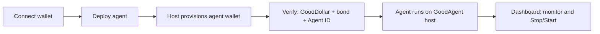

# @goodagent/widget

Embeddable GoodAgent UI for **any listed skill** on [goodagentids.xyz/skills](https://goodagentids.xyz/skills). Partners embed deploy → vouch → dashboard on their site using the **user’s wallet** — no private key export.

**Latest:** `@goodagent/widget@0.1.5`  
**Backend:** `https://goodagentids.xyz/host` + `https://goodagentids.xyz/api` (hosted by GoodAgent — you do not run this yourself)

**Partner guides:** [GameArena integration](./GAMEARENA_INTEGRATION.md) (offchain Markov agents)

---

## Step-by-step: add the widget to your app

### Step 1 — Check prerequisites

You need:

| Requirement | Notes |
|-------------|--------|
| **React 18+** | `react`, `react-dom` as peers |
| **A connected wallet on Celo** | User signs deploy, vouch, pause/resume |
| **A page to embed the widget** | e.g. `/agents`, settings, or a modal |

Pick **one** wallet stack:

- **Privy** — add `@privy-io/react-auth` and wrap your app in `<PrivyProvider>`
- **wagmi** — add `wagmi` + `viem` and wrap in `<WagmiProvider>`

Your app must be able to **sign messages and send transactions** on Celo mainnet (G$ bond, Agent ID attestation).

---

### Step 2 — Install the package

```bash
pnpm add @goodagent/widget react react-dom

# If you use Privy:
pnpm add @privy-io/react-auth

# If you use wagmi instead:
pnpm add wagmi viem @tanstack/react-query
```

---

### Step 3 — Pick a skill

Choose a skill id from [goodagentids.xyz/skills](https://goodagentids.xyz/skills) or the [registry JSON](https://github.com/sam-thetutor/goodagent-skills/blob/main/registry.json).

Common exports from the package:

| Constant | Skill id |
|----------|----------|
| `GAMEARENA_SKILL_ID` | `gaming/wagering/gamearena_1v1` |
| `ACTIONORDER_SKILL_ID` | `gaming/card-fighter/actionorder_vshouse` |
| `UBI_REMINDER_SKILL_ID` | `social/reminder/ubi_claim_reminder` |
| `BALAIO_WORKER_SKILL_ID` | `work/marketplace/balaio_worker` |

Set a **`partnerId`** (your project slug) so deploys are attributed to you, e.g. `"my-game"` or `"acme-app"`.

---

### Step 4 — Wire up a wallet adapter

The widget does not connect wallets itself — you pass an adapter from your existing stack.

#### Option A — Privy (recommended for embedded / MiniPay / WalletConnect sites)

```tsx
import { usePrivyWalletAdapter } from "@goodagent/widget";

function MyPage() {
  // preferExternal: use MetaMask / MiniPay instead of Privy embedded when available
  const wallet = usePrivyWalletAdapter({ preferExternal: true });

  // wallet.address, wallet.isConnected, wallet.signMessage, etc.
}
```

Your app root must already have `<PrivyProvider>` configured for Celo.

#### Option B — wagmi

```tsx
import { createWalletAdapterFromHooks } from "@goodagent/widget";
import {
  useAccount,
  useConnect,
  useSignMessage,
  useSignTypedData,
  useWriteContract,
  useWaitForTransactionReceipt,
} from "wagmi";

function useGoodAgentWallet() {
  const { address, isConnected } = useAccount();
  const { connect, connectors } = useConnect();
  const { signMessageAsync } = useSignMessage();
  const { signTypedDataAsync } = useSignTypedData();
  const { writeContractAsync } = useWriteContract();
  const { waitForTransactionReceipt } = useWaitForTransactionReceipt();

  return createWalletAdapterFromHooks({
    address,
    isConnected,
    connect: async () => {
      const c = connectors[0];
      if (c) await connect({ connector: c });
    },
    signMessageAsync,
    signTypedDataAsync,
    writeContractAsync,
    waitForTransactionReceipt,
  });
}
```

---

### Step 5 — Add the widget component

You only pass **what varies** (`partnerId`, skill, optional overrides). API URLs, RPC, vault, registry, skill defaults, and face-verify callback are filled in automatically.

**GameArena (simplest):**

```tsx
import {
  GoodAgentWidget,
  createGameArenaWidgetConfig,
  usePrivyWalletAdapter,
} from "@goodagent/widget";
import "@goodagent/widget/styles.css";

export function AgentsPage() {
  const wallet = usePrivyWalletAdapter({ preferExternal: true });

  return (
    <GoodAgentWidget
      mode="full"
      wallet={wallet}
      config={createGameArenaWidgetConfig({ partnerId: "your-project-slug" })}
    />
  );
}
```

**Any skill:**

```tsx
import {
  GoodAgentWidget,
  createGoodAgentWidgetConfig,
  GAMEARENA_SKILL_ID,
} from "@goodagent/widget";

config={createGoodAgentWidgetConfig(GAMEARENA_SKILL_ID, {
  partnerId: "your-project-slug",
})}
```

Advanced self-hosting only — then pass `hostBaseUrl` / `apiBaseUrl` overrides.

---

### Step 6 — Import styles

Always import the stylesheet **once** in the component (or your app entry) that renders the widget:

```tsx
import "@goodagent/widget/styles.css";
```

Without this, tabs, cards, and buttons will look unstyled.

---

### Step 7 — Test the full user flow

Open your page, connect a wallet, then walk through:

1. **Deploy tab** — enter agent name → deploy → wait for provisioning (wallet may sign pipeline start).
2. **Verify tab** — select the agent → complete:
   - GoodDollar face verification (redirect back via `fvCallbackUrl`)
   - G$ bond (on-chain tx from user wallet)
   - Agent ID attestation (sign + tx)
3. **Dashboard tab** — pick agent → see balances, record, Stop/Start.

If deploy stays on “provisioning”, check the host is reachable:

```bash
curl https://goodagentids.xyz/host/health
```

---

### Step 8 — Customize (optional)

**Show only one surface:**

```tsx
<GoodAgentWidget mode="deploy" ... />
<GoodAgentWidget mode="vouch" deployId="..." agentAddress="0x..." ... />
<GoodAgentWidget mode="dashboard" ... />
```

**Pre-configure skill settings (hide the form):**

```tsx
config={createGoodAgentWidgetConfig(GAMEARENA_SKILL_ID, {
  partnerId: "your-project-slug",
  // hideSkillConfig: true,  // optional — lock settings for name-only deploy
})}
```

**Custom settings UI:**

```tsx
<GoodAgentWidget
  renderSkillConfig={({ config, onChange }) => (
    <MyFields values={config} onChange={onChange} />
  )}
  config={...}
  wallet={wallet}
/>
```

---

## What your users do (end-to-end)



- **User wallet** — owns the deploy, signs vouch steps, pause/resume.
- **Agent play wallet** — created and run on GoodAgent servers; never shown to the user.

---

## Minimal copy-paste example (Privy + Game Arena)

```tsx
"use client";

import {
  GoodAgentWidget,
  createGoodAgentWidgetConfig,
  GAMEARENA_SKILL_ID,
  usePrivyWalletAdapter,
} from "@goodagent/widget";
import "@goodagent/widget/styles.css";

export default function AgentsPage() {
  const wallet = usePrivyWalletAdapter({ preferExternal: true });

  if (!wallet.isConnected) {
    return (
      <button type="button" onClick={() => void wallet.connect?.()}>
        Connect wallet
      </button>
    );
  }

  return (
    <GoodAgentWidget
      mode="full"
      wallet={wallet}
      config={createGoodAgentWidgetConfig(GAMEARENA_SKILL_ID, {
        partnerId: "your-project-slug",
        fvCallbackUrl: window.location.href,
      })}
    />
  );
}
```

---

## Config reference

Partners pass `GoodAgentWidgetPartnerConfig`. Static fields are resolved automatically.

| Field | Required | Description |
|-------|----------|-------------|
| `skillId` | yes | Skill from registry |
| `partnerId` | recommended | Attribution tag stored on deploy |
| `skillConfiguration` | no | Overrides merged onto skill defaults |
| `defaultDisplayName` | no | Prefilled agent name (skill default if omitted) |
| `hideSkillConfig` | no | Hide settings form when pre-configured |
| `deployHint` / `skillLabel` | no | Custom UI copy (skill defaults if omitted) |
| `telegramBotToken` | no | Required for UBI reminder skill |
| `fvCallbackUrl` | no | GoodDollar return URL (current page if omitted) |

**Filled automatically (omit unless self-hosting):** `hostBaseUrl`, `apiBaseUrl`, `rpcUrl`, `vaultAddress`, `registryUrl`, `goodDollarEnv`, `deployTemplate`, base `skillConfiguration`, `statusPollMs`.

Use `createGameArenaWidgetConfig({ partnerId })` for the GameArena offchain preset.

---

## Widget modes

| `mode` | Shows |
|--------|--------|
| `"full"` | Deploy → Verify → Dashboard (tabbed) |
| `"deploy"` | Deploy only |
| `"vouch"` | Vouch only |
| `"dashboard"` | Dashboard only |

---

## Wallet adapters

| Site stack | Adapter |
|------------|---------|
| Privy | `usePrivyWalletAdapter()` |
| wagmi | `createWalletAdapterFromHooks()` |
| Custom | Implement `GoodAgentWalletAdapter` |

---

## Headless API (no React UI)

Build your own UI with:

- `createHostClient(hostBaseUrl)` — deploy, status, start/stop
- `createApiClient(apiBaseUrl)` — verify URLs, registry
- `fetchSkillRegistry()` — list skills
- `signDeployControl()` — signed pause/resume

---

## Troubleshooting

| Issue | What to check |
|-------|----------------|
| Widget unstyled | Import `@goodagent/widget/styles.css` |
| “Connect wallet” never resolves | Pass a connected adapter; implement `connect` if needed |
| Signing hangs (MetaMask) | Use wagmi adapter or `usePrivyWalletAdapter({ preferExternal: true })` |
| Deploy stuck provisioning | `curl https://goodagentids.xyz/host/health`; user must sign pipeline start |
| Verify redirect fails | Set `fvCallbackUrl` to your page URL (must be allowlisted by GoodDollar flow) |
| Dashboard stats slow | Ensure host is current; widget fetches lite status first, then stats |

---

## Links

- [GoodAgent skills registry](https://goodagentids.xyz/skills)
- [Agent explorer](https://goodagentids.xyz/explore)
- [Verify API docs](https://goodagentids.xyz/for-agents)
